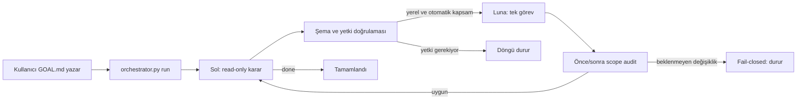

# Thesis Codex CLI Orchestrator V1 — Ayrıntılı Kullanım ve İşletim Kılavuzu

Bu dizin, tez workspace'i içinde iki kalıcı Codex CLI rolünü sınırlı ve denetlenebilir bir döngüde
çalıştırmak için hazırlanmış yerel kontrol katmanıdır.

> **En önemli açıklama:** Mevcut V1 bir görsel terminal paneli/TUI değildir. Terminalde kutular,
> canlı agent akışı veya tuşla yönetilen bir kokpit sunmaz. Python ile çalışan **headless bir CLI
> orchestrator**'dır. Komutla başlar; sonuçları JSON, JSONL ve log dosyalarına yazar. Codex Desktop
> içindeki task listesiyle aynı şey değildir ve CLI session'ları uygulamada otomatik olarak iki
> isimli task şeklinde görünmeyebilir.

Bu README, sistemin ne yaptığını, ne yapmadığını, nasıl güvenli biçimde çalıştırılacağını, nasıl
durdurulacağını ve mevcut kurulumun gerçek durumunu tek yerde anlatır.

---

## 1. Kısa özet

Sistemde iki rol vardır:

- **Sol / Director:** Workspace'i yalnızca read-only inceler; hedefin tamamlanıp tamamlanmadığına
  karar verir ve gerekiyorsa Luna'ya tam olarak bir adet sınırlı görev üretir.
- **Luna / Executor:** Yalnızca Sol'un doğrulanmış karar dosyasındaki görevi uygular; kapsamı
  genişletemez ve sonraki görevi kendisi seçemez.

Temel akış şöyledir:



Normal kullanımda sistem:

1. `.agents/GOAL.md` içindeki aktif hedefi okur.
2. Kalıcı Sol session'ından yapılandırılmış bir karar ister.
3. Kararı JSON Schema ve ek Python kontrolleriyle doğrular.
4. Yalnızca izin verilen yerel kapsamdaysa Luna'ya yollar.
5. Luna'nın raporunu doğrular.
6. Workspace'in önce/sonra durumunu karşılaştırır.
7. Sonucu yeniden Sol'a inceletir.
8. Hedef tamamlanana, engellenene veya sınır dolana kadar devam eder.

---

## 2. Şu anki kurulumun durumu

9 Ağustos 2026 itibarıyla:

- V1 dosyaları oluşturuldu.
- Sol ve Luna için iki kalıcı Codex CLI session'ı bootstrap edildi.
- Temel doctor kontrolleri geçti.
- Orchestrator bir gerçek read-only smoke turu çalıştırdı.
- İki Git repository birbirinden bağımsız olarak doğru biçimde tespit edildi.
- Smoke turunda proje dosyası değişmedi.
- İkinci Sol incelemesi sırasında kullanıcı isteğiyle işlem kesildi.
- Hedef şu anda `PAUSED` durumundadır.
- `.agents/STOP` işareti mevcuttur; yeni bir otomatik tur başlatılmamalıdır.
- Çalışan bir orchestrator/model turu bırakılmamıştır.

Kalıcı session kimlikleri:

| Rol | Model | Session UUID |
|---|---|---|
| Sol / Director | `gpt-5.6-sol` | `019fe7af-ad1a-7d21-aa66-8c14dc9b5bb7` |
| Luna / Executor | `gpt-5.6-luna` | `019fe7af-e5d2-76b3-b957-d27af1a6224c` |

Bu UUID'ler yalnızca tekrar kullanılabilir CLI konuşma bağlamlarıdır. Arka planda kendi kendine
çalışan daemon/process değillerdir. `orchestrator.py run` çağrılmadıkça model turu başlatmazlar.

### Smoke-test özeti

İlk başarılı Sol → Luna turunda:

- `transfer-vs-relearning/` ayrı bir Git repository olarak okundu.
- `syntheticFacts/` ayrı bir Git repository olarak okundu.
- Workspace root'u yanlışlıkla tek bir Git repository kabul edilmedi.
- Önce ve sonra snapshot'larının ikisi de 424 kayıt içerdi.
- İki snapshot'ın SHA-256 özeti aynıydı:
  `0475ff12781bde5d846939d15b1eb76966df54c41e764bddb5d1efdd6cfa9f60`.
- Değişen yol listesi boştu.
- Beklenmeyen yol listesi boştu.
- Unit testlerin 8'i geçti; 2 test, Luna'nın read-only sandbox'ında kullanılabilir geçici dizin
  bulunmadığı için assertion'a ulaşmadan hata verdi.
- Sol bu iki assertion'ı dosya oluşturmadan tekrar kontrol etmek için ikinci bir read-only görev
  hazırladı; bu tur kullanıcı isteğiyle yürütülmeden kesildi.

Bu nedenle smoke test **kısmen başarılı ama tamamlanmış sayılmamıştır**. Sistem şu anda bilinçli
olarak kapalı/duraklatılmıştır.

---

## 3. Bu sistem nedir, ne değildir?

### Nedir?

- İki Codex CLI session'ı arasında rol ayrımı kuran yerel bir Python programıdır.
- Dosya tabanlı bir kontrol ve kanıt katmanıdır.
- Kararları ve worker raporlarını şemaya bağlı JSON olarak alır.
- Belirli yerel değişiklikleri otomatik çalıştırabilir.
- Her turun girdisini, model event akışını, final çıktısını ve scope audit'ini saklar.
- Birden fazla Git repository bulunan workspace'i destekler.
- Beklenmeyen değişiklikte otomatik revert yapmadan durur.
- Bilimsel/operasyonel yetkiyi `AGENTS.md` ve ilgili sözleşmelerin üzerine çıkarmaz.

### Değildir?

- Görsel terminal dashboard'u değildir.
- `tmux`, `screen`, Textual, Rich veya curses tabanlı bir TUI değildir.
- Codex Desktop task yöneticisi değildir.
- Sol ve Luna'yı iki görünür terminal panelinde canlı göstermez.
- Arka planda sürekli çalışan bir servis/daemon değildir.
- Model JSON'undan gelen shell komutlarını körlemesine çalıştıran bir sistem değildir.
- HU, SSH, Slurm, GPU veya training launcher değildir.
- Genel amaçlı güvenlik sandbox'ının yerine geçmez.
- Kullanıcı yetkisi gerektiren işi kendi kendine yetkilendiremez.
- Commit, push, deploy veya cleanup robotu değildir.

### CLI ile Desktop uygulaması arasındaki fark

Bu orchestrator `codex exec` ve `codex exec resume` kullanır. Böyle oluşturulan session UUID'leri
Codex CLI bağlamlarıdır. Codex Desktop içindeki sidebar task'larıyla birebir aynı nesne gibi
düşünülmemelidir. Session'lara verilen `THESIS · SOL · DIRECTOR` ve
`THESIS · LUNA · EXECUTOR` adları yapılandırma etiketleridir; Desktop'ta otomatik olarak görünen
task başlıkları olacağı garanti edilmez.

---

## 4. Dizin yapısı

```text
.agents/
├── README.md                         # Bu kullanım ve işletim kılavuzu
├── GOAL.md                           # Tek aktif hedef ve kullanıcı kapsamı
├── POLICY.md                         # Rol ayrımı ve otomasyon güvenlik politikası
├── config.json                       # Modeller, repolar, limitler ve izlenen yollar
├── orchestrator.py                   # Ana CLI programı
├── STOP                              # Varsa yeni rol turundan önce durdurur
├── prompts/
│   ├── sol-turn.md                   # Sol'un her tur prompt şablonu
│   └── luna-turn.md                  # Luna'nın her tur prompt şablonu
├── schemas/
│   ├── decision.schema.json          # Sol kararının JSON Schema'sı
│   └── worker-report.schema.json     # Luna raporunun JSON Schema'sı
├── state/
│   ├── sessions.json                 # Kalıcı Sol/Luna UUID'leri
│   ├── runtime.json                  # Son bilinen orchestrator durumu
│   ├── decision.json                 # Son doğrulanmış Sol kararı
│   ├── worker-report.json            # Son doğrulanmış Luna raporu
│   ├── history.jsonl                 # Append-only karar/rapor özeti
│   ├── orchestrator.lock             # Aynı anda ikinci process'i engelleyen lock dosyası
│   ├── bootstrap-sol.events.jsonl    # İlk Sol session oluşturma eventleri
│   ├── bootstrap-sol.stderr.log      # Sol bootstrap stderr'i
│   ├── bootstrap-luna.events.jsonl   # İlk Luna session oluşturma eventleri
│   └── bootstrap-luna.stderr.log     # Luna bootstrap stderr'i
├── runs/
│   └── <UTC-timestamp>-round-NNN/    # Her round için ayrı kanıt dizini
└── tests/
    └── test_orchestrator.py          # Saf yerel unit testleri
```

### Workspace ilişkisi

`.agents/config.json` içindeki `workspace_root` değeri `..` olduğu için kontrol edilen workspace:

```text
/Users/umutyesildal/Desktop/UniDE/Semester6/Thesis/implementation
```

Bu root bir Git repository değildir. İçinde en az iki bağımsız repository vardır:

```text
implementation/
├── transfer-vs-relearning/.git
└── syntheticFacts/.git
```

Bu yüzden Git komutları root'ta değil, daima hedef repository ile çalıştırılır:

```bash
git -C transfer-vs-relearning status --short --branch
git -C syntheticFacts status --short --branch
```

---

## 5. Yetki hiyerarşisi

Orchestrator yeni yetki üretmez. Kaynak sırası:

1. Kullanıcının güncel ve açık talimatı.
2. Workspace root'undaki `AGENTS.md`.
3. Göreve uygulanıyorsa güncel frozen contract, gate ve `LUNA_WORKER_CURRENT_HANDOFF.md`.
4. `.agents/GOAL.md` içindeki güncel sınırlı hedef.
5. `.agents/state/decision.json` içindeki tek worker görevi.

Alt sıradaki bir kaynak üst sıranın vermediği yetkiyi veremez. Örneğin eski bir CLI session'ında
“training yapabilirsin” denmiş olması yeni bir goal için yetki sayılmaz.

### Proje özelinde kritik sınırlar

Mevcut workspace kuralları doğrultusunda aşağıdakiler orchestrator tarafından otomatik başlamaz:

- HU/SSH bağlantısı veya remote host işlemi;
- Slurm job submission;
- GPU kullanımı;
- training, evaluation, inference veya benchmark scoring;
- model, tokenizer, corpus veya geniş dataset indirme;
- corpus materialization;
- push, publish, deploy veya release;
- silme, cleanup, reset, restore, checkout, stash veya force işlemleri;
- credential/secret erişimi;
- frozen artifact veya geçmiş evidence root değişiklikleri;
- rezerv edilmiş bilimsel dokümanları oluşturma/değiştirme.

Bu işlerden biri gerekiyorsa Sol'un doğru davranışı `awaiting_authorization` döndürmek; programın
doğru davranışı da Luna'yı başlatmadan durmaktır.

---

## 6. Roller

### 6.1 Sol — Director

Sol daima `read-only` sandbox ile çağrılır.

Sorumlulukları:

- güncel goal ve otoriteyi okumak;
- önceki worker raporu varsa incelemek;
- genel hedefin bitip bitmediğine karar vermek;
- bitmediyse yalnızca bir sonraki görevi tanımlamak;
- görevin scope sınıfını belirlemek;
- izin verilen yolları dar biçimde listelemek;
- acceptance criteria ve gerekli kanıtı tanımlamak;
- yetki gerekiyorsa açık, sınırlı bir authorization request üretmek.

Yapamayacakları:

- dosya düzenlemek;
- işi kendisi implement etmek;
- Luna adına kapsam genişletmek;
- eski oturum konuşmasından yeni yetki çıkarmak;
- eksik kullanıcı onayını var saymak.

Sol'un olası karar durumları:

| Durum | Anlamı |
|---|---|
| `continue` | Hedef bitmedi; Luna'ya yeni bir görev verilebilir. |
| `rework` | Önceki çıktı yetersiz; aynı görev ailesinde düzeltme gerekir. |
| `done` | Goal acceptance criteria tamamlandı. |
| `blocked` | Mevcut kapsam içinde ilerlemek mümkün değil. |
| `awaiting_authorization` | Kullanıcıdan yeni/açık yetki gerekiyor. |

### 6.2 Luna — Executor

Luna yalnızca `.agents/state/decision.json` içindeki tek görevi yürütür.

Sandbox seçimi:

| Sol scope'u | Luna sandbox'ı | Otomatik dispatch? |
|---|---|---|
| `local_read_only` | `read-only` | Evet |
| `local_write` | `workspace-write` | Evet, allowed paths zorunlu |
| `external_read_only` | Başlatılmaz | Hayır |
| `external_write` | Başlatılmaz | Hayır |
| `destructive` | Başlatılmaz | Hayır |

Luna'nın sorumlulukları:

- yalnızca mevcut task'ı yapmak;
- allowed paths dışına çıkmamak;
- mevcut dirty/untracked dosyaları korumak;
- gerekli bounded testleri çalıştırmak;
- yaptığı komutları ve test sonuçlarını raporlamak;
- görev bitmiyorsa `partial` veya `blocked` demek;
- tam ve schema-valid worker report üretmek.

Luna'nın yapamayacakları:

- kendi sonraki görevini seçmek;
- scope'u genişletmek;
- kendisine yetki vermek;
- `decision.json` veya `worker-report.json` dosyasını doğrudan canonical çıktı olarak yazmak;
- commit/push/publish/delete/cleanup gibi yasaklı işlemler yapmak.

---

## 7. Karar ve rapor veri sözleşmeleri

### 7.1 Sol decision alanları

Sol'un final JSON'u tam olarak şu alanları içerir:

| Alan | Amaç |
|---|---|
| `goal_id` | Kararı aktif GOAL ile bağlar. |
| `status` | continue/rework/done/blocked/awaiting_authorization. |
| `task_id` | Luna görevinin stabil kimliği. |
| `task` | Tek ve somut görev metni. |
| `reason` | Neden bu kararın alındığı. |
| `scope_class` | İşin etki sınıfı. |
| `requires_user_authorization` | Yeni kullanıcı izni gerekip gerekmediği. |
| `authorization_request` | Gerekiyorsa tam izin talebi. |
| `allowed_paths` | Local-write için yazılabilecek dar yollar/globlar. |
| `forbidden_actions` | Bu görevde açıkça yasaklananlar. |
| `acceptance_criteria` | Görevin kabul koşulları. |
| `required_evidence` | Sol'un sonraki turda görmek istediği kanıt. |

Python doğrulaması ayrıca şunları kontrol eder:

- eksik veya fazla top-level alan olmaması;
- goal ID'nin aktif goal ile eşleşmesi;
- task ve reason gibi gerekli değerlerin boş olmaması;
- `local_write` kararında en az bir allowed path bulunması;
- `awaiting_authorization` kararında authorization request bulunması;
- scope ve status değerlerinin bilinen enumlardan olması.

### 7.2 Luna worker-report alanları

| Alan | Amaç |
|---|---|
| `goal_id` | Raporu aktif goal ile bağlar. |
| `status` | completed/partial/blocked. |
| `task_id` | Raporu Sol'un göreviyle bağlar. |
| `summary` | Kısa sonuç özeti. |
| `files_changed` | Değiştirildiği iddia edilen workspace-relative yollar. |
| `commands_run` | Komut ve sonuç kayıtları. |
| `tests` | Test komutu, passed/failed/not_run ve özet. |
| `acceptance_criteria_results` | Her kriter için durum ve kanıt. |
| `issues` | Açık problemler. |
| `review_notes` | Sol için notlar. |

Modelin verdiği JSON doğrudan güvenilerek kullanılmaz. Önce Codex `--output-schema`, ardından
orchestrator'ın ek semantic validation fonksiyonları çalışır. Başarılı doğrulamadan sonra canonical
state dosyasına atomik biçimde yazılır.

---

## 8. Yapılandırma

Ana ayarlar `.agents/config.json` içindedir.

### Modeller

```json
"models": {
  "sol": "gpt-5.6-sol",
  "luna": "gpt-5.6-luna"
}
```

### Repository listesi

```json
"repositories": [
  "transfer-vs-relearning",
  "syntheticFacts"
]
```

Yeni bir repository eklemek, otomatik yazma yetkisi vermez. Yalnızca snapshot ve Git durum
kontrolü kapsamına alır. Repository'nin gerçekten `.git` içermesi gerekir; aksi halde `doctor`
hata verir.

### Root watch paths

Git repository dışında kalan fakat bilimsel kayıt veya operasyon açısından önemli root yolları
fingerprint ile izlenir:

```text
AGENTS.md
LUNA_WORKER_CURRENT_HANDOFF.md
documentation/
ssh-client/
scripts/
paper/
output/
outputs/
```

### Otomatik scope sınıfları

Yalnızca:

```json
["local_read_only", "local_write"]
```

Bu listeyi genişletmek ciddi bir politika değişikliğidir. Özellikle external veya destructive
scope'u buraya eklemek önerilmez.

### Limitler

| Ayar | Mevcut değer | İşlev |
|---|---:|---|
| `max_rounds` | 6 | Bir `run` içindeki toplam Sol/Luna döngü sınırı. |
| `max_rework_per_task` | 2 | Aynı task için rework sınırı. |
| `same_decision_max` | 3 | Aynı karar tekrarlanırsa fail-closed sınırı. |
| `turn_timeout_seconds` | 1800 | Tek model turu için 30 dakika. |
| `run_wall_clock_seconds` | 3600 | Tüm run için 60 dakika. |
| `max_file_hash_bytes` | 16777216 | Tam hash alınacak dosya boyutu üst sınırı, 16 MiB. |

Büyük dosyalar tam okunup hashlenmez; boyut ve modification time bilgisiyle fingerprint edilir.
Bu performans önlemidir, kriptografik artifact doğrulamasının yerine geçmez.

---

## 9. Kurulum ön koşulları

Gerekli temel araçlar:

- macOS/Linux benzeri bir ortam;
- Python 3;
- Codex CLI;
- `git`;
- Codex CLI'da geçerli oturum/kimlik doğrulaması;
- iki repository'nin config'teki yollarında bulunması.

Bu kurulumda doğrulanan Codex CLI sürümü:

```text
codex-cli 0.147.0-alpha.6.5
```

Orchestrator şu CLI özelliklerine ihtiyaç duyar:

- `codex exec`;
- `codex exec resume`;
- `--json`;
- `--output-schema`;
- `--output-last-message` / `-o`;
- `--sandbox` / `-s`;
- `--skip-git-repo-check`.

İlk kontrol:

```bash
cd /Users/umutyesildal/Desktop/UniDE/Semester6/Thesis/implementation
python3 .agents/orchestrator.py doctor
```

`doctor` model çağrısı yapmaz. Dosyaları, schema uyumluluğunu, CLI seçeneklerini, repository
yollarını, Git status erişimini, goal template durumunu ve session UUID formatını kontrol eder.

---

## 10. İlk bootstrap

Session'lar hiç oluşturulmamışsa:

```bash
python3 .agents/orchestrator.py bootstrap --yes
```

Bu komut:

1. Doctor kontrollerini çalıştırır.
2. Sol için read-only bir başlangıç `codex exec` çağrısı yapar.
3. JSONL eventlerinden session UUID'yi çıkarır.
4. Luna için aynı işlemi yapar.
5. UUID'leri `state/sessions.json` içine yazar.

`--yes` zorunludur çünkü bootstrap iki model çağrısı oluşturur.

UUID zaten geçerliyse bootstrap mevcut session'ı korur ve yenisini açmaz. Yeni session'lar gerçekten
isteniyorsa `sessions.json` bilinçli biçimde yönetilmelidir; eski UUID'leri rastgele silmek geçmiş
bağlamı ve evidence izini koparabilir.

Bu workspace'te bootstrap zaten yapılmıştır. Normal durumda tekrar gerekmez.

---

## 11. Yeni goal hazırlama

Her bağımsız iş için `.agents/GOAL.md` güncellenir.

Önerilen yapı:

```markdown
# Current Orchestrator Goal

Status: ACTIVE
Goal ID: 2026-08-09-kisa-aciklayici-hedef-v1

## Objective

Tek, somut ve test edilebilir hedef.

## Acceptance criteria

- Birinci ölçülebilir koşul.
- İkinci ölçülebilir koşul.

## Allowed paths

- transfer-vs-relearning/path/to/file.py
- transfer-vs-relearning/tests/**

## Explicit prohibitions

- No HU/SSH.
- No push, deletion, training, or external mutation.
```

### Goal yazım kuralları

- `Status: ACTIVE` olmadan gerçek run başlamamalıdır.
- Her yeni hedefte yeni ve stabil bir Goal ID kullanılmalıdır.
- Goal tek bir sonuç etrafında sınırlandırılmalıdır.
- Allowed paths mümkün olduğunca dar tutulmalıdır.
- “Projeyi düzelt” gibi açık uçlu hedeflerden kaçınılmalıdır.
- Test veya kabul kanıtı açıkça yazılmalıdır.
- HU/training gibi işlemler için yalnızca GOAL.md yazmak yeterli değildir; güncel proje otoritesi
  ve açık kullanıcı yetkisi ayrıca gerekir.
- Eski decision/report yalnızca aynı `goal_id` ile eşleşiyorsa bağlam olarak kullanılmalıdır.

Goal durumları orchestrator tarafından tam bir enum olarak parse edilmese de operasyon için şu
anlamlar kullanılmalıdır:

| Goal durumu | Kullanım |
|---|---|
| `NOT_SET` | Şablon; hiçbir gerçek işe yetki vermez. |
| `ACTIVE` | Kullanıcı bu hedef için run yapılmasını istiyor. |
| `PAUSED` | Hedef korunuyor ama yeni run yapılmamalı. |
| `COMPLETED` | Hedef tamamlandı; yeni iş için yeni Goal ID gerekir. |

---

## 12. Komutlar

Tüm komutlar workspace root'undan çalıştırılmalıdır.

### Doctor

```bash
python3 .agents/orchestrator.py doctor
```

- Read-only ön kontrol yapar.
- Model çağrısı yapmaz.
- Dosya veya project state değiştirmemesi beklenir.

### Dry run

```bash
python3 .agents/orchestrator.py run --dry-run
```

- Model çağrısı yapmaz.
- Workspace, repository listesi, scope sınıfları, limitler ve session ID'lerini gösterir.
- Gerçek run'dan önce önerilen kontroldür.
- STOP işaretini kaldırmaz.

### Gerçek run

```bash
python3 .agents/orchestrator.py run
```

Bu komut model turu başlatabilir ve goal `local_write` görevi üretiyorsa workspace dosyalarında
izinli değişikliklere yol açabilir. Çalıştırmadan önce:

1. `GOAL.md` kontrol edilmelidir.
2. `AGENTS.md` ve ilgili bilimsel otorite kontrol edilmelidir.
3. `STOP` işareti bilinçli biçimde kaldırılmalıdır.
4. `run --dry-run` görülmelidir.
5. Mevcut dirty/untracked durum bilinmelidir.

### Status

```bash
python3 .agents/orchestrator.py status
```

Persist edilmiş son runtime ve session bilgisini yazdırır. Bu değerler bir process monitor değildir;
ani `Ctrl-C`, crash veya power loss sonrasında `runtime.json` stale kalabilir.

### Cooperative stop

```bash
python3 .agents/orchestrator.py stop
```

`.agents/STOP` oluşturur. Orchestrator bu dosyayı **bir sonraki rol turundan önce** kontrol eder.
Devam eden bir `codex exec` çağrısını ortasında anında kesmez.

### STOP kaldırma

```bash
python3 .agents/orchestrator.py clear-stop
```

Bu yalnızca marker'ı kaldırır; otomatik olarak `run` başlatmaz. Goal hâlâ `ACTIVE` mi, kullanıcı
gerçekten devam etmek istiyor mu ve scope uygun mu ayrıca kontrol edilmelidir.

### Unit tests

```bash
PYTHONDONTWRITEBYTECODE=1 python3 -m unittest discover -s .agents/tests -v
```

`PYTHONDONTWRITEBYTECODE=1`, test sırasında `.agents/__pycache__` oluşmasını önler. Normal yerel
terminalde testler için kullanılabilir bir temp dizini bulunmalıdır.

---

## 13. Bir run içeride nasıl çalışır?

### Başlangıç doğrulamaları

Gerçek `run` başlamadan önce program:

- config'i okur;
- workspace root'un güvenli ve mevcut olduğunu doğrular;
- `AGENTS.md` bulunduğunu kontrol eder;
- `.agents/STOP` varsa durur;
- `GOAL.md` içinde aktif ve stabil bir Goal ID bekler;
- Sol ve Luna UUID'lerinin biçimini doğrular;
- tek-process lock alır.

### Round başlangıcı

Her round için UTC tabanlı benzersiz bir dizin oluşturulur:

```text
.agents/runs/YYYYMMDDTHHMMSSZ-round-001/
```

Ardından workspace'in `snapshot-before.json` kaydı alınır.

### Sol çağrısı

Basitleştirilmiş çağrı mantığı:

```text
codex exec
  -C <workspace>
  --skip-git-repo-check
  -m gpt-5.6-sol
  -s read-only
  --json
  --output-schema decision.schema.json
  -o sol-final.json
  resume <sol-session-uuid>
```

Prompt stdin üzerinden gönderilir. Final karar hem schema hem Python semantic validation'dan geçer.

### Dispatch kararı

Program şu koşulların tamamı doğruysa Luna'yı başlatır:

- status `continue` veya `rework`;
- `requires_user_authorization` false;
- scope `local_read_only` veya `local_write`;
- karar aktif Goal ID ile eşleşiyor;
- tekrar ve rework limitleri aşılmamış;
- local-write ise allowed paths boş değil.

### Luna çağrısı

Luna aynı kalıcı session'ı `resume` eder. Scope read-only ise read-only, local-write ise
workspace-write sandbox kullanılır. Luna'nın final raporu `worker-report.schema.json` ve Python
kontrollerinden geçer.

### Scope audit

Luna'dan sonra ikinci snapshot alınır. Program:

- HEAD değişikliklerini;
- tracked/untracked path durumlarını;
- küçük dosya hashlerini;
- büyük dosya metadata fingerprintlerini;
- root watch path değişikliklerini

karşılaştırır.

Değişen bir yol allowed paths kapsamı dışındaysa:

- run `blocked` olur;
- beklenmeyen yollar raporlanır;
- **otomatik revert yapılmaz**.

Otomatik revert yapılmaması önemlidir; workspace zaten dirty olabilir ve kullanıcı dosyalarını
geri almak daha fazla zarar verebilir.

### Bir sonraki round

Worker raporu state'e yazılır. Sonraki Sol turu bu raporu inceler ve `done`, yeni `continue`,
`rework`, `blocked` veya `awaiting_authorization` döndürür.

---

## 14. Snapshot ve multi-repository güvenliği

### Git repository snapshot'ı

Her configured repository için:

- `git rev-parse HEAD`;
- `git status --porcelain=v1 -z --untracked-files=all`;
- status'ta görünen her path için fingerprint

alınır.

HEAD özel bir kayıt olarak tutulur:

```text
transfer-vs-relearning::HEAD
syntheticFacts::HEAD
```

Bir HEAD değişikliği normal path globuyla izinli kabul edilmez. Örneğin
`transfer-vs-relearning/**` yazılmış olsa bile commit/checkout sonucu oluşan `::HEAD` değişimi
allowed sayılmaz.

### Mevcut dirty dosyalar

Snapshot sistemi “workspace temiz olmalı” varsayımı yapmaz. Önceden dirty veya untracked olan
dosyalar baseline'a dahil edilir. Amaç bunları silmek değil, Luna turunda yeni değişip
değişmediklerini belirlemektir.

### Root watch

Root Git repository olmadığı için `documentation/`, `AGENTS.md` ve diğer kritik kök yollar ayrı
fingerprint mekanizmasıyla izlenir.

### Sınır

Bu mekanizma pratik bir fail-closed kontrolüdür; işletim sistemi seviyesinde tam güvenlik kanıtı
değildir. Codex sandbox, dosya izinleri, kullanıcı talimatı ve proje authority dosyaları birlikte
esas korumayı sağlar.

---

## 15. Evidence ve log dosyaları

Her round dizininde beklenebilecek dosyalar:

| Dosya | İçerik |
|---|---|
| `snapshot-before.json` | Role çağrısından önce workspace fingerprintleri. |
| `sol-events.jsonl` | Codex CLI Sol event akışı. |
| `sol-stderr.log` | Sol CLI stderr çıktısı. |
| `sol-final.json` | Codex'in schema-bound final Sol cevabı. |
| `sol-invocation.json` | Kullanılan argümanlar ve exit code. |
| `decision.json` | Doğrulanmış, round'a özel Sol kararı. |
| `luna-events.jsonl` | Codex CLI Luna event akışı. |
| `luna-stderr.log` | Luna CLI stderr çıktısı. |
| `luna-final.json` | Codex'in schema-bound final Luna cevabı. |
| `luna-invocation.json` | Kullanılan argümanlar ve exit code. |
| `worker-report.json` | Doğrulanmış, round'a özel worker raporu. |
| `snapshot-after.json` | Worker sonrasında workspace fingerprintleri. |
| `scope-check.json` | Değişen ve beklenmeyen yollar. |

Bir rol başlamadan veya tamamlanmadan interrupt olursa o role ait dosyaların bazıları eksik
olabilir. Bu normaldir; eksik final JSON başarı kanıtı olarak yorumlanmamalıdır.

### Önemli V1 log davranışı

Mevcut implementation `subprocess.run(..., capture_output=True)` kullanır. Bu nedenle model JSONL
eventleri rol çalışırken terminale canlı akmaz; subprocess tamamlanınca dosyaya yazılır. Uzun bir
tur sırasında terminal “sessiz” görünebilir. Bu sessizlik tek başına hang anlamına gelmez.

Son run dizinlerini görmek:

```bash
find .agents/runs -maxdepth 1 -type d | sort
```

Bir scope audit'i okumak:

```bash
python3 -m json.tool .agents/runs/<round-directory>/scope-check.json
```

Son canonical karar ve rapor:

```bash
python3 -m json.tool .agents/state/decision.json
python3 -m json.tool .agents/state/worker-report.json
```

---

## 16. Durdurma ve güvenli kapatma

### Yeni run başlamasını engellemek

```bash
python3 .agents/orchestrator.py stop
```

ve `GOAL.md` içinde:

```text
Status: PAUSED
```

birlikte en açık kapalı durumdur.

### Devam eden terminal komutunu kesmek

Orchestrator foreground'da çalışıyorsa:

```text
Ctrl-C
```

Mevcut V1'de `KeyboardInterrupt` için özel temiz kapanış handler'ı henüz yoktur. Bu yüzden traceback
görülebilir ve `state/runtime.json` eski `running` değerinde kalabilir. Böyle bir durumda:

1. Terminal process'inin gerçekten sona erdiği kontrol edilir.
2. STOP marker oluşturulur.
3. Goal `PAUSED` yapılır.
4. Stale runtime'ın gerçek çalışan process kanıtı olmadığı bilinmelidir.

### Lock davranışı

`state/orchestrator.lock`, `fcntl.flock` ile aynı anda ikinci run'ı engeller. Process normal veya
interrupt ile sonlandığında işletim sistemi lock'ı serbest bırakır. Lock dosyasının diskte kalması
tek başına process'in çalıştığı anlamına gelmez.

### Session'ların “kapatılması”

Codex CLI session UUID'si process değildir. Run durunca session yalnızca tekrar kullanılabilecek
bir kayıt olarak kalır. Session dosyasını silmek gerekmez. Otomatik çalışma ancak yeni bir
`orchestrator.py run` komutuyla başlar.

---

## 17. Önerilen güvenli günlük kullanım akışı

### Salt okunur bir inceleme

```bash
cd /Users/umutyesildal/Desktop/UniDE/Semester6/Thesis/implementation
python3 .agents/orchestrator.py doctor
```

Sonra:

1. `GOAL.md` için yeni Goal ID yaz.
2. `Status: ACTIVE` yap.
3. Allowed paths'i “None/read-only” şeklinde açıkla.
4. Prohibitions içine external ve write yasaklarını ekle.
5. STOP'u yalnızca bilerek kaldır:

```bash
python3 .agents/orchestrator.py clear-stop
python3 .agents/orchestrator.py run --dry-run
python3 .agents/orchestrator.py run
```

### Yerel kod değişikliği

1. Hedef repository'yi açıkça yaz.
2. Tam dosya veya dar glob allowed paths ver.
3. İlgisiz dirty/untracked dosyaların korunmasını acceptance criterion yap.
4. Test komutlarını veya beklenen test sınıfını yaz.
5. Commit/push'u açıkça yasakla.
6. Önce dry-run gör.
7. Run sonrasında iki repository'de ayrı ayrı `git status` ve hedef diff'i incele.

### HU/training ihtiyacı doğarsa

V1 bunu otomatik dispatch etmemelidir. Beklenen sonuç:

```text
awaiting_authorization
```

Ardından kullanıcı, güncel frozen contract ve `AGENTS.md` birlikte incelenir. Ayrı, tam sınırlı ve
açık yetki olmadan orchestrator yeniden başlatılmaz.

---

## 18. Hata giderme

### `GOAL.md is not ACTIVE`

Neden: Goal şablon, paused veya completed olabilir.

Çözüm: Gerçekten yeni bir çalışma isteniyorsa yeni Goal ID ile bilinçli biçimde `ACTIVE` yap.
Sistemi yalnızca test etmek için eski Goal ID'yi gelişigüzel aktive etme.

### `STOP marker detected`

Neden: `.agents/STOP` mevcut.

Çözüm: Bu bilinçli kapatma işaretidir. Kullanıcı gerçekten devam etmek istiyorsa goal ve scope'u
inceledikten sonra `clear-stop` çalıştır.

### `Another orchestrator process already holds the lock`

Neden: Başka bir `run` aynı anda çalışıyor olabilir.

Çözüm: İkinci run başlatma. İlk terminali bul ve bekle/durdur. Lock dosyasını silmek canlı flock'ı
güvenli biçimde ortadan kaldırmaz.

### `Codex CLI not found on PATH`

Neden: `codex` kurulmamış veya shell PATH'i farklı.

Kontrol:

```bash
command -v codex
codex --version
```

### Session UUID invalid/not initialized

Neden: `state/sessions.json` eksik, bozuk veya bootstrap tamamlanmamış.

Çözüm:

```bash
python3 .agents/orchestrator.py doctor
python3 .agents/orchestrator.py bootstrap --yes
```

Mevcut geçerli UUID'leri gereksiz yere değiştirme.

### Output schema hatası

Bu Codex CLI sürümünde bazı standart JSON Schema keyword'leri desteklenmeyebilir. V1 doctor şu
keyword'leri schema içinde fail olarak işaretler:

```text
uniqueItems
minLength
maxLength
pattern
minimum
maximum
```

Gerekli semantic kontroller Python tarafında yapılır. Schema'ya yeni keyword eklerken önce
`doctor` ve gerçek CLI uyumluluğu test edilmelidir.

### Unit testlerde temp directory hatası

Read-only sandbox içinde Python şu hatayı verebilir:

```text
FileNotFoundError: No usable temporary directory found
```

Bu, test assertion'ının yanlış olduğunu kanıtlamaz; `tempfile.TemporaryDirectory()` daha assertion'a
ulaşmadan başarısız olmuş olabilir. Normal kullanıcı terminalinde `/tmp` yazılabilir durumdaysa
suite tekrar çalıştırılabilir. Bilimsel/project dosyalarına temp workaround yazılmamalıdır.

### Terminal uzun süre sessiz

V1 eventleri canlı stream etmez; rol bitene kadar capture eder. Kontrol seçenekleri:

- beklemek;
- ayrı terminalde process durumunu incelemek;
- gerektiğinde foreground terminalde `Ctrl-C`;
- sonrasında STOP + PAUSED uygulamak.

### `runtime.json` hâlâ `running`

Ani interrupt sonrası stale olabilir. `runtime.json` heartbeat veya process registry değildir.
Foreground komut sona ermiş, lock serbest ve yeni Codex subprocess yoksa gerçek sistem çalışmıyor
olabilir. Runtime dosyasını kanıt zincirini gözeterek bilinçli biçimde `interrupted/stopped`
durumuna düzeltmek gerekir.

### `AGENTS.md` truncation uyarısı

Root `AGENTS.md` oldukça büyüktür. Codex CLI otomatik instruction injection sırasında 32 KiB
sınırına ulaştığını söyleyebilir. Prompt şablonları agent'a dosyayı diskten ayrıca okumasını söyler;
yine de gereksiz token maliyeti ve bağlam karmaşası yaratabilir. Gelecek sürümde authority routing
ve daha kısa root instruction tasarımı değerlendirilebilir. Bu uyarı görmezden gelinip yetki
varsayılmamalıdır.

---

## 19. Bilinen V1 sınırlamaları

1. **Görsel arayüz yok.** Dashboard/TUI uygulanmadı.
2. **Canlı event streaming yok.** Rol çıktısı subprocess sonunda dosyaya yazılır.
3. **Immediate interrupt state cleanup eksik.** `Ctrl-C` traceback ve stale runtime bırakabilir.
4. **STOP cooperative.** Devam eden model turunu ortasında kesmez.
5. **Desktop task görünürlüğü yok.** CLI session UUID'leri app sidebar task'ı değildir.
6. **Büyük authority context maliyeti yüksek.** Agent'lar çok büyük `AGENTS.md` ve bilimsel kayıt
   zincirini okuyabilir.
7. **V1 tam güvenlik sandbox'ı değil.** Uygulama seviyesi validation ve snapshot audit sağlar.
8. **Snapshot tam filesystem monitor değil.** Config'teki repository ve watch path kapsamıyla
   sınırlıdır.
9. **Büyük dosyalar tam hashlenmez.** Boyut/mtime fingerprint kullanılır.
10. **Session context zamanla şişebilir.** Kalıcı resume geçmişi token ve yönlendirme maliyetini
    artırabilir.
11. **Goal status parser sınırlı.** İnsan tarafından doğru lifecycle yönetimi gerekir.
12. **Otomatik revert yok.** Bu kasıtlıdır; beklenmeyen değişiklik insan incelemesine bırakılır.

---

## 20. Olası V2 / görsel terminal tasarımı

Kullanıcının beklediği gerçek “orchestrator kontrol paneli” mevcut V1'den ayrı bir geliştirmedir.
Uygulanırsa önerilen özellikler:

- curses/Textual/Rich tabanlı tek terminal dashboard'u;
- Sol ve Luna için ayrı canlı event panelleri;
- aktif role, round, goal, model ve süre göstergesi;
- repository branch/HEAD/dirty özetleri;
- `Run`, `Stop`, `Immediate interrupt`, `Doctor`, `Edit Goal`, `Quit` tuşları;
- model eventlerinin gerçek zamanlı stream edilmesi;
- STOP ve process sinyallerinin ayrı gösterilmesi;
- stale runtime tespiti;
- son decision/report/scope-check özeti;
- token kullanım göstergesi;
- kullanıcı onayı gerektiğinde belirgin bekleme ekranı;
- küçük terminal boyutlarında güvenli fallback;
- non-interactive snapshot modu ve TUI testleri.

Bu özellikler **şu anda uygulanmış değildir**. README'de gelecek tasarım olarak bulunmaları mevcut
V1'in bunları yaptığı anlamına gelmez.

---

## 21. Güvenlik kontrol listesi

Gerçek `run` öncesi:

- [ ] Kullanıcı bu run'ı gerçekten istedi mi?
- [ ] Goal ID yeni ve doğru mu?
- [ ] Goal status `ACTIVE` mi?
- [ ] Objective tek ve ölçülebilir mi?
- [ ] Allowed paths dar mı?
- [ ] `AGENTS.md` ve uygulanabilir contract/gate okundu mu?
- [ ] İş HU/training/external/destructive kapsamına giriyor mu?
- [ ] İki repository'nin mevcut dirty/untracked durumu biliniyor mu?
- [ ] `doctor` geçti mi?
- [ ] `run --dry-run` beklendiği gibi mi?
- [ ] STOP yalnızca bilinçli biçimde kaldırıldı mı?

Run sonrası:

- [ ] Runtime terminal durumda mı (`done`, `blocked`, `stopped`, vb.)?
- [ ] Son `scope-check.json` incelendi mi?
- [ ] İki repository ayrı ayrı kontrol edildi mi?
- [ ] Beklenmeyen dosya değişikliği var mı?
- [ ] Model raporundaki test iddiası gerçek logla uyuşuyor mu?
- [ ] Yetki isteyen bir karar otomatik uygulanmamış mı?
- [ ] Goal tamamlandıysa `COMPLETED`, ara verildiyse `PAUSED` yapıldı mı?
- [ ] Yeni run istenmiyorsa STOP marker kondu mu?

---

## 22. Sık sorulan sorular

### “Sol ve Luna şu anda çalışıyor mu?”

Hayır. Session UUID'lerinin dosyada bulunması çalışan process demek değildir. Orchestrator yalnızca
`run` komutu sırasında Codex CLI subprocess çağırır.

### “İki ayrı görsel terminal görecek miyim?”

Hayır. Mevcut V1 headless çalışır. Görsel TUI henüz yapılmamıştır.

### “Desktop'ta iki isimli task neden görünmüyor?”

Çünkü bootstrap edilen nesneler non-interactive Codex CLI session'larıdır; Desktop task/sidebar
nesnesi olmak zorunda değildir.

### “STOP dosyası sistemi tamamen öldürür mü?”

Yeni role geçmeden önce döngüyü durdurur. Devam eden model subprocess'i için foreground terminalde
`Ctrl-C` gerekebilir.

### “Luna istediği dosyayı değiştirebilir mi?”

Politikaya göre hayır. Local-write için allowed paths gerekir; ardından snapshot audit bağımsız
olarak değişen yolları kontrol eder. Yine de bu bir OS-level formal sandbox garantisi değildir.

### “Orchestrator kendi kendine HU'ya bağlanır mı?”

Hayır. External scope otomatik dispatch edilmez; proje kuralları ayrıca HU/SSH için açık authority
ve preflight gerektirir.

### “Mevcut dirty dosyaları temizler mi?”

Hayır. Otomatik clean/reset/revert yapılmaz. Mevcut dosyalar kullanıcıya ait kabul edilir.

### “Bir goal bitince session'ları silmeli miyim?”

Hayır. Yeni Goal ID ile aynı session'lar tekrar kullanılabilir. Ancak çok büyüyen veya karışan
session context'i için bilinçli yeni bootstrap stratejisi gelecekte değerlendirilebilir.

### “Sadece durum görmek model tokenı harcar mı?”

`doctor`, `status`, `run --dry-run` ve dosya okumaları model turu başlatmaz. `bootstrap --yes` ve
gerçek `run` model çağrısı yapar.

---

## 23. Mevcut kapalı durumdan yeniden başlatma

Şu an sistem bilinçli biçimde kapalıdır. Yeniden başlatmak için otomatik olarak yalnızca komutları
kopyalayıp çalıştırmak yerine şu sıra izlenmelidir:

1. Bu README'nin özellikle “Bilinen V1 sınırlamaları” bölümünü oku.
2. Görsel TUI bekleniyorsa mevcut V1'i çalıştırma; önce V2 açıkça implemente edilmeli.
3. Eski smoke goal'ü yeniden kullanma; yeni amaç için yeni Goal ID yaz.
4. Goal'ü `ACTIVE` yap.
5. `doctor` çalıştır.
6. Mevcut repository durumlarını incele.
7. `clear-stop` çalıştır.
8. `run --dry-run` gör.
9. Ancak kullanıcı gerçek model turunu açıkça istiyorsa `run` çalıştır.

Örnek:

```bash
cd /Users/umutyesildal/Desktop/UniDE/Semester6/Thesis/implementation
python3 .agents/orchestrator.py doctor
python3 .agents/orchestrator.py clear-stop
python3 .agents/orchestrator.py run --dry-run
# Yalnızca açıkça istenirse:
python3 .agents/orchestrator.py run
```

---

## 24. Son söz

V1'in güçlü tarafı görsellik değil; rol ayrımı, schema-bound kararlar, kapsam sınırı, çoklu
repository farkındalığı ve kanıt saklamadır. En önemli kullanım prensibi şudur:

> **GOAL.md niyeti tarif eder; AGENTS.md ve güncel contract yetkiyi sınırlar; Sol tek işi seçer;
> Luna yalnızca o işi yapar; orchestrator sonucu bağımsız snapshot ile kontrol eder; kullanıcı
> istemedikçe hiçbir run başlamaz.**

Mevcut durumda goal duraklatılmış, STOP marker yerleştirilmiş ve otomatik çalışma kapatılmıştır.
