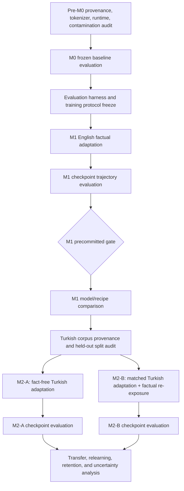

# 178 — End-to-End Experimental Plan: M0 → M1 → M2-A/M2-B

## 1. Purpose and status

This document is the end-to-end study and planning document for a clean, evaluation-first
replication and extension of the project. It connects the theory in Chapters 01–12 to the actual
workflow:

```text
pre-M0 audit → M0 baseline → protocol freeze → M1 factual adaptation
→ M1 checkpoint evaluation → comparison and interpretation
→ Turkish corpus audit → M2-A / M2-B sibling adaptations
→ causal transfer/relearning analysis
```

This is a study plan, not an execution authorization. The current project authorities require an
exact model/dataset/commit/task contract and separate authorization before HU access, Slurm jobs,
new training, or new evaluation are started. Existing historical results remain immutable evidence.

The main operational/scientific authorities are:

- [Document 144 — supervisor feedback and scientific realignment](144_SUPERVISOR_FEEDBACK_AND_SCIENTIFIC_REALIGNMENT_TR.md);
- [Document 145 — literature-first M1 and Turkish route](145_LITERATURE_FIRST_M1_MODEL_AND_TURKISH_ADAPTATION_ROUTE_TR.md);
- [Document 146 — read-only research/audit handoff](146_LUNA_WORKER_2_DETAILED_RESEARCH_AND_AUDIT_HANDOFF_TR.md);
- [Document 177 — evaluation-first OLMo and M2 priority realignment](177_SUPERVISOR_FEEDBACK_EVALUATION_FIRST_OLMO_AND_M2_PRIORITY_REALIGNMENT_TR.md).

The plan is deliberately designed to make every number interpretable. A result is never recorded
as only `score = 0.82`; it is recorded with its question, unit, direction, baseline, uncertainty,
comparison, and limitations.

## 2. Scientific questions

The project contains three different claims. They must remain separate:

1. **M1 acquisition:** Can the base model acquire controlled English synthetic facts?
2. **Adaptation and retention:** Can Turkish continued pretraining improve Turkish capability while
   preserving English language modeling and previously acquired factual access?
3. **Relearning mechanism:** Does controlled Turkish factual re-exposure produce an additional
   gain over matched fact-free Turkish adaptation?

The corresponding states are:

```text
M0   = frozen pretrained base model
M1   = M0 after English synthetic factual adaptation
M2-A = M1 after general Turkish adaptation with no target facts
M2-B = M1 after the same Turkish budget plus controlled Turkish factual re-exposure
```

Historical Qwen reports use `M2-clean` and `M3-fact`. Conceptually, those are the completed pilot’s
M2-A-like and M2-B-like sibling arms; they are not a serial M2-then-M3 training chain.

## 3. Complete dependency graph



The dependency graph prevents outcome-driven decisions. For example, a checkpoint is not selected
because it looks best after inspection; the selection rule is frozen before the result is known.

## 4. Phase 0 — pre-M0 audit

Pre-M0 checks are not scientific scores. They establish whether a model and its inputs are valid
for a scientific baseline.

### 4.1 Model and tokenizer provenance

For Qwen and OLMo, freeze and hash:

- model identifier and immutable weight revision;
- base/pretrained versus instruction/chat status;
- tokenizer identifier and immutable tokenizer revision;
- vocabulary size and special-token mapping;
- architecture and parameter count;
- context length and model-native padding behavior;
- documented language/provenance evidence;
- local file inventory and SHA-256 manifest.

Qwen is a multilingual positive control; its exact Turkish exposure is not known well enough to
call it Turkish-unseen. OLMo is an English-dominant candidate, but zero Turkish exposure is also
not automatically proven by a model card. Provenance claims must therefore be labelled as
`documented`, `not listed`, or `unknown`, rather than converted into certainty.

### 4.2 Tokenizer audit

Run small, frozen English and Turkish samples through both tokenizers and record:

- tokens per word and tokens per character;
- Turkish suffix/diacritic fragmentation;
- empty or pathological encodings;
- BOS/EOS/PAD IDs and decode behavior;
- answer-token boundary detection for every factual prompt/candidate pair;
- tokenizer save/reload equivalence.

Raw token PPL is not a safe cross-model ranking when tokenizers differ. Word PPL, byte PPL, BPB,
token counts, and tokenizer fertility must be reported together.

### 4.3 Runtime and numerical smoke

Before a GPU job:

- load model and tokenizer offline;
- run a finite forward pass;
- verify logits shape and vocabulary offset;
- run a finite single-example backward pass;
- verify the planned BF16/FP16 route on the selected GPU class;
- verify PAD/EOS behavior;
- verify that the optimizer can be constructed;
- verify that the output namespace is fresh and scratch-only.

A failed optimizer smoke or compatibility guard is an operational `NOT_RUN`, not a model score.

### 4.4 Synthetic-fact prior and contamination audit

Before M1, evaluate the frozen M0 model on the future fact inventory. This checks whether the base
model already assigns high probability to any synthetic fact or answer and establishes a proper
pre-acquisition baseline. It does not prove that the model has semantic knowledge of a fact.

The audit should include exact canonical prompts, paraphrases, direct/QA scaffolds, candidate
distractors, and training/evaluation overlap checks.

## 5. Phase 1 — M0 baseline evaluation

M0 is the first scientific state. Every later change is interpreted relative to it, although M2
retention is primarily compared with its immediate M1 parent.

### 5.1 Official LM Evaluation Harness bundle

The harness version and commit must be pinned before task names are frozen. The candidate matrix
from Document 177 is:

| Task/family | Role |
|---|---|
| `wikitext` | official rolling word PPL, byte PPL, and BPB |
| `blimp` | English grammatical minimal-pair likelihood |
| `hellaswag` | English commonsense continuation accuracy |
| `winogender` | pronoun/coreference diagnostic |
| `turblimp_core` | Turkish grammatical minimal pairs |
| `turkishmmlu` | Turkish knowledge/reasoning capability |
| `xnli` family | matched English/Turkish natural-language inference |
| `xquad` | optional reading comprehension |
| `xcopa` | optional causal commonsense |
| Pile-10k custom task | complementary broad-domain English retention |

The exact XNLI task IDs, TurkishMMLU access, prompt templates, few-shot count, metric names, and
dataset revisions must be validated with `lm-eval ls tasks` and `lm-eval validate`. EWOK and Turkish
HellaSwag must not be invented or silently replaced by machine translation.

### 5.2 Custom factual and generic bundle

The official harness does not replace project-specific factual tests. M0 also receives:

- EN→EN, TR→EN, and TR→TR factual candidate ranking;
- Forms A–D and direct/QA scaffolds;
- relation-wise and worst-cell accuracy;
- robust fact-level intersections;
- relation-swapped controls;
- generic completions with empty/EOS/repetition/diversity diagnostics.

### 5.3 M0 baseline record

Each model receives one frozen baseline card containing:

```text
model/tokenizer identity
corpus and task revisions
PPL word/byte/BPB and custom PPL
English and Turkish capability metrics
EN→EN/TR→EN/TR→TR factual metrics
generation-integrity metrics
confidence intervals
known contamination/provenance limitations
```

## 6. Phase 2 — training protocol and hyperparameter freeze

The project does not train either model from random initialization. It uses full-parameter
adaptation of a pretrained causal language model unless a later contract explicitly changes this.

### 6.1 M1 objective

M1 is best described as **full-parameter causal-LM factual adaptation**. Historical recipes use
answer-only next-token loss for synthetic facts: prompt tokens provide context, while answer tokens
are the supervised targets. This is not LoRA and not instruction-chat SFT.

### 6.2 M2 objective

M2-A and M2-B are **full-parameter language-adaptive continual pretraining** (CPT/DAPT/LAPT). The
full Turkish sequence contributes next-token loss, including non-factual generic Turkish text.

### 6.3 Fields that must be frozen

The training contract must explicitly bind:

- model/tokenizer revisions;
- objective and label masking;
- block/sequence length;
- learning rate, scheduler, warmup, weight decay, AdamW betas/epsilon;
- gradient clipping;
- microbatch, accumulation, effective batch;
- total optimizer updates, total supervised tokens, and cycling policy;
- BF16/FP16/FP32 route and gradient checkpointing;
- training/data seeds;
- EOS supervision;
- checkpoint and evaluation grid;
- validation split and corpus hashes;
- output, cache, temporary, and artifact locations.

### 6.4 Historical values as candidates, not automatic new settings

The following are useful starting references, not yet a new authorization:

| Stage | Historical candidate |
|---|---|
| M1 | answer-only CLM, block size 128, effective batch about 500, 252 updates, checkpoints every 42 updates, BF16 if validated, EOS supervision disabled |
| M2 bridge-like adaptation | full-sequence CLM, block size 512, 128 updates, checkpoints 32/64/96/128, BF16 if validated |

The OLMo historical learning rate of `5e-5` and the Qwen Turkish-bridge learning rate of `1e-5`
must not be assumed to be universally fair across architectures. A fresh Qwen/OLMo replication must
precommit whether it uses one common logical recipe or model-specific memory-safe decompositions.
The scientific comparison should at minimum match total tokens, factual exposure, update budget,
sequence policy, seed policy, and evaluation grid.

## 7. Phase 3 — M1 training

For each model, M1 performs:

```text
base weights → tokenized synthetic English facts → forward pass
→ answer-token loss → backward pass → AdamW update → checkpoint
```

Microbatch and gradient accumulation are memory controls, not changes to the intended effective
batch. For example, `microbatch=5` and `accumulation=100` produce an effective batch of 500
sequences on one device while only five sequences are resident per forward pass.

Training logs must report both raw and derived quantities:

- step and epoch;
- training/validation loss;
- supervised answer tokens and total tokens;
- learning rate;
- microbatch, accumulation, and effective batch;
- gradient norm and clipping events;
- optimizer and precision;
- wall time and hardware;
- checkpoint hash and manifest status.

## 8. Phase 4 — M1 checkpoint evaluation

The M1 trajectory is more informative than a single endpoint. At the precommitted grid, run a
cheap panel; run the full hard suite only at precommitted milestone checkpoints if cost requires a
cascade.

### 8.1 Factual acquisition

- deterministic exact-prefix generation where that metric is explicitly defined;
- candidate ranking by mean answer-token log probability;
- Forms A–D;
- direct and QA scaffolds;
- relation-wise accuracy;
- same-subject relation swaps;
- held-out form generalization;
- robust fact-level intersection;
- EN→EN, TR→EN, and TR→TR directions.

### 8.2 Language retention and capability

- official WikiText word PPL, byte PPL, and BPB;
- custom PPL reconciliation;
- Pile-10k if the custom task is validated;
- BLiMP, HellaSwag, Winogender, and compatible XNLI tasks;
- Turkish smoke capability where the M1 baseline is meaningful.

### 8.3 Generation integrity

- lexical-empty output;
- near-empty length diagnostic kept separately;
- immediate or early EOS;
- repeated 3/4-grams;
- distinct-1/2/3;
- longest repeated-token run;
- synthetic-subject intrusion;
- generic completion accuracy.

## 9. Phase 5 — M1 comparison and interpretation

M0→M1 comparison must be metric-specific:

| Metric family | Interpretation |
|---|---|
| Factual accuracy | Did the model acquire the injected facts? |
| Robust intersection | Does acquisition survive wording and scaffold changes? |
| English PPL/BPB | Did English next-token modeling deteriorate? |
| EN→EN factual access | Did previously acquired facts remain accessible? |
| BLiMP/HellaSwag/etc. | Did general English capability change? |
| Degeneration | Did generation become empty, repetitive, or prematurely terminated? |

No metric is a universal intelligence score. A high factual score with a large PPL increase is a
retention trade-off, not an unqualified success.

Checkpoint selection must be precommitted, such as “earliest checkpoint passing all gates.” It must
not be chosen after seeing which row makes a model look best.

## 10. Phase 6 — Turkish corpus audit and update

Before M2 training, freeze the Turkish corpus family:

- source and revision;
- licence and provenance;
- language filtering and deduplication;
- document length and quality statistics;
- training/validation/test separation;
- synthetic-fact contamination audit;
- tokenizer fertility and token counts;
- held-out in-domain Turkish split;
- cross-domain control such as `trwiki-20260601` where authorized.

The primary in-domain split must not be fabricated from a convenient corpus after observing a
result. The current authorities keep corpus selection/materialization and `ready_to_train` gated.

## 11. Phase 7 — M2-A training and evaluation

M2-A starts independently from the same frozen M1 checkpoint used by M2-B:

```text
M1 → general Turkish CPT with no target synthetic factual bindings
```

The manipulation check asks whether the language adaptation actually worked:

- Turkish held-out PPL;
- TurBLiMP;
- TurkishMMLU;
- XNLI-TR;
- tokenizer/token-count diagnostics.

Retention and factual measures are run on the same grid:

- English WikiText/Pile-10k;
- BLiMP/HellaSwag/XNLI-EN;
- EN→EN factual retention;
- TR→EN primary transfer;
- TR→TR secondary access;
- generic degeneration.

The main transfer contrast is:

\[
\Delta_{transfer} = Acc(TR\rightarrow EN, M2\text{-}A)
                     - Acc(TR\rightarrow EN, M1).
\]

## 12. Phase 8 — M2-B training and evaluation

M2-B is a sibling, not a continuation:

```text
M1 → same-budget Turkish CPT + controlled Turkish factual re-exposure
```

All quantities remain matched with M2-A:

- same M1 parent;
- same seed and data order;
- same total tokens and optimizer updates;
- same sequence length and checkpoint schedule;
- same evaluation bundle.

M2-B factual rows replace matched neutral Turkish positions; they are not extra tokens. This keeps
the causal contrast focused on factual re-exposure.

The primary relearning contrast is:

\[
\Delta_{relearn} = Acc(TR\rightarrow EN, M2\text{-}B)
                    - Acc(TR\rightarrow EN, M2\text{-}A).
\]

The result is a replicated causal claim only if the precommitted sign and confidence criterion are
met across the required seeds. A positive point estimate in one seed is descriptive evidence, not
automatic proof.

## 13. Final analysis package

The final package should contain:

1. M0 baseline table for Qwen and OLMo;
2. M1 checkpoint trajectory;
3. M0→M1 acquisition/retention/capability contrasts;
4. M2-A and M2-B checkpoint trajectories;
5. Turkish manipulation checks;
6. EN→EN retention guardrail;
7. TR→EN transfer and M2-B−M2-A relearning contrasts;
8. relation/form/scaffold/worst-cell breakdowns;
9. subject-level bootstrap intervals;
10. seed replication table;
11. provenance and contamination manifest;
12. hardware, precision, optimizer, and checkpoint integrity manifests.

For every metric, include:

```text
What question does it answer?
How is it calculated?
What is the unit?
Is higher or lower better?
What is the baseline?
What changed?
What is the confidence interval?
What can the metric not prove?
```

## 14. GPU and hardware plan

GPU names are resource plans, not scientific variables. Every selected device must pass a clean
preflight rather than being trusted because Slurm reports it as idle.

| GPU class | Intended role | Required caution |
|---|---|---|
| RTX 3090 24 GB | evaluation, smoke, memory-safe smaller training | use verified microbatch/accumulation and precision route |
| RTX A6000 48 GB | preferred full-parameter 1B–1.5B training candidate | require zero foreign processes and free-memory bound |
| A100 40/80 GB | high-memory training and evaluation | queue and foreign-process state must be checked |
| V100 32 GB | possible route only after model/precision validation | BF16/FP16 support and PyTorch/CUDA compatibility are not assumed |
| CPU | manifests, tokenizer checks, task discovery, small validation | not a substitute for scientific GPU training |

Preflight must record:

- GPU UUID and node;
- free/used VRAM;
- foreign processes;
- CUDA/PyTorch compatibility;
- model-load and optimizer smoke result;
- scratch capacity and inode state;
- output-root absence;
- expected commit and dataset hashes.

If no device satisfies the frozen bounds, the run stops as an operational `NOT_RUN`; it is not
rerouted by silently changing precision, optimizer, threshold, or recipe.

## 15. Suggested teaching rhythm

The practical study sequence should mirror the experiment:

1. Learn tokenizer IDs and answer-token masking on one fact.
2. Compute one causal-LM loss by hand.
3. Inspect one optimizer update and effective batch.
4. Run or inspect one M0 PPL example.
5. Learn official harness `loglikelihood` versus `loglikelihood_rolling`.
6. Read one M1 factual probe row.
7. Interpret one PPL ratio and one confidence interval.
8. Compare one M0→M1 checkpoint.
9. Learn corpus train/validation contamination.
10. Derive the M2-A transfer and M2-B relearning estimands.

This makes the final tables readable rather than mysterious.

## 16. Non-negotiable interpretation rules

- PPL is not factual accuracy.
- Factual accuracy is not general language capability.
- English retention is not Turkish adaptation.
- A positive point estimate is not a replicated causal effect.
- A failed runtime/optimizer guard is not a scientific negative.
- Missing rows are not zero.
- Raw token PPL is not automatically comparable across tokenizers.
- A checkpoint cannot be selected post hoc because it looks attractive.
- M2-B cannot receive extra total tokens relative to M2-A.
- Qwen’s completed pilot and OLMo’s completed negative result remain historical evidence; a new
  replication does not overwrite them.

The goal of this design is not to force a positive result. The goal is to make every result—positive,
negative, inconclusive, or operationally blocked—scientifically legible and reproducible.
