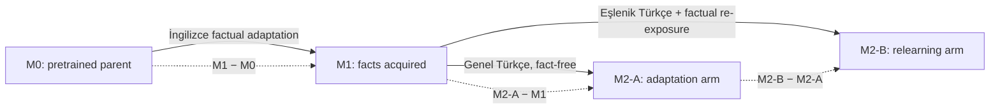
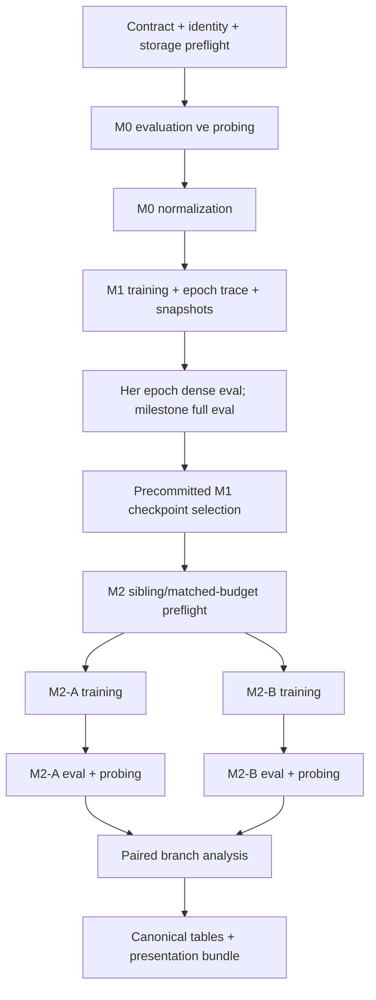

# Eval-v1 ve M0→M2 deney sistemi: derinlemesine Türkçe rehber

**Kapsam:** bilimsel tasarım, bütün metrikler, eğitim/evaluation akışı, artefaktlar,
paralel Slurm yürütmesi ve Luna çalışma modeli

**Durum:** eval-v1 donduruldu; üç modelli bilimsel M0 wave'i bir kez gönderildi; M1 ve M2
eğitimleri henüz yetkilendirilmedi

**Son operasyonel durum fotoğrafı:** 2026-08-16T15:51:59Z

> Bu belge açıklayıcı bir insan rehberidir. Yeni bir bilimsel sözleşme değildir, mevcut eşikleri
> değiştirmez ve execution yetkisi vermez. Kesin makine gerçeği
> [`eval_v1_registry.yaml`](../../configs/evaluation/eval_v1_registry.yaml), bilimsel girdi kaydı
> [`eval_v1_scientific_inputs_v1.yaml`](../../configs/evaluation/eval_v1_scientific_inputs_v1.yaml),
> dondurulmuş [`eval-v1` sözleşmesi](../contracts/evaluation/eval-v1.md) ve canlı
> [`PROJECT_STATE.yaml`](../current/PROJECT_STATE.yaml) içindedir.

## 1. Bir cümlede ne kurduk?

Aynı üç temel modeli aynı dondurulmuş ölçüm sistemiyle M0'da ölçen; daha sonra her modeli İngilizce
sentetik olgularla M1'e, aynı M1 parent'ından çıkan eşlenik Türkçe `M2-A` ve `M2-B` kollarına
taşıyacak; her aşamada **olgu erişimi, genel yetenek, İngilizce/Türkçe dil kaybı, üretim sağlığı ve
belirsizliği** ayrı ayrı kaydedecek, sonuçları tek bir sahte “genel skor” altında ezmeyecek bir deney
sistemi kurduk.

Sistemin temel ilkeleri şunlardır:

1. Model, veri, tokenizer, evaluator, environment ve seed kimlikleri sonuçtan önce dondurulur.
2. Metrik aileleri farklı bilimsel sorulara cevap verir; hepsini toplayan evrensel skor yoktur.
3. Her checkpoint yalnızca doğru parent'ıyla karşılaştırılır.
4. Eksik veya operasyonel olarak çökmüş sonuç `0` değildir; açık bir eksiklik durumudur.
5. Ham çıktı korunur; normalize tablo ve sunum dosyaları ham çıktıdan yeniden üretilebilir.
6. M2-A ve M2-B ardışık değildir; aynı M1 checkpoint'ından başlayan kardeş kollardır.
7. Sonuç görüldükten sonra prompt, eşik, checkpoint veya recipe değiştirmek yasaktır.

## 2. Bilimsel soru ve dört model durumu

| Durum | Model ne görür? | Asıl soru |
|---|---|---|
| `M0` | Orijinal pretrained model | Başlangıç yeteneği, başlangıç Türkçe seviyesi ve sentetik olgulara tesadüfi erişim nedir? |
| `M1` | İngilizce sentetik factual adaptation | İngilizce olgular öğrenildi mi ve genel yetenek ne kadar korundu? |
| `M2-A` | M1 + olgu içermeyen genel Türkçe continued pretraining | Türkçe dil adaptasyonu, İngilizce öğrenilmiş olgulara Türkçe prompt ile erişimi kendiliğinden açıyor mu? |
| `M2-B` | Aynı M1 + M2-A ile eşlenik Türkçe bütçe + kontrollü Türkçe olgu re-exposure | Türkçe olguyu yeniden göstermek, yalnızca genel Türkçe adaptasyonundan ne kadar daha güçlü? |

Temel karşılaştırmalar:

- **Acquisition:** `M1 − M0`
- **Transfer/adaptation:** `M2-A − M1`
- **Relearning katkısı:** `M2-B − M2-A`
- **Retention:** her durumun kendi gerçek parent'ına göre değişimi

Dolayısıyla `M2-B − M1` tek başına relearning etkisi değildir. İçinde hem Türkçe adaptasyonu hem de
factual re-exposure vardır. Relearning'in temiz tahmini kardeş kollar arasındaki `M2-B − M2-A`
farkıdır.



Tam bilimsel tasarımın ana kaynağı
[`178_END_TO_END_EXPERIMENTAL_PLAN_AND_EVALUATION_PROTOCOL_EN.md`](../178_END_TO_END_EXPERIMENTAL_PLAN_AND_EVALUATION_PROTOCOL_EN.md)
belgesidir.

## 3. Kontrol düzlemi nasıl çalışıyor?

Projede her Markdown aynı role sahip değildir. Karışıklığı önlemek için şu hiyerarşi kullanılır:

| Katman | Rolü | Örnek |
|---|---|---|
| `AGENTS.md` | Kısa güvenlik ve yönlendirme kuralları | Ajanın ilk okuduğu küçük dosya |
| `documentation/current/` | Şu anki makine-okunur durum | `PROJECT_STATE.yaml` |
| `documentation/contracts/` | Değişmez deney ve execution sözleşmeleri | `eval-v1.md` |
| `configs/` | Sözleşmenin çalıştırılabilir kesin bağları | task, model, corpus ve Slurm ayarları |
| `documentation/records/` | Tarihsel gerçekleşen olay ve kanıt | submission/failure/result kayıtları |
| `documentation/evaluation/` | İnsan rehberi, inventory ve şema | bu belge, evaluator inventory |
| `.agents/task-packets/` | Luna için tek görevlik mikro-context | bir stage, dar dosya listesi |

Bu belge uzun olabilir; çünkü zorunlu ajan başlangıç context'i değildir. Luna'nın her turda bunu
okuması beklenmez. İlgili task packet yalnızca ihtiyaç duyduğu en fazla birkaç kaynağı isimlendirir.

## 4. Baştan sona pipeline



Tek-model lifecycle 15 stage olarak
[`run_study.py`](../../scripts/study/run_study.py) tarafından planlanır. Üç modelin cohort akışı
[`run_model_matrix.py`](../../scripts/study/run_model_matrix.py) ile 27 node'a genişler:

- 12 state-evaluation node'u;
- 9 training node'u;
- 6 yerel preflight/analysis node'u.

Bugün yalnızca üç modelli bilimsel **M0 ham evaluation operatorü** çalıştırılabilir durumdadır.
M1/M2 adapter recipe'leri ve ilgili corpus sözleşmeleri henüz dondurulmadığı için bütün pipeline
`planned_not_authorized` durumundadır. Ayrıntılı operator sınırı
[`pipeline/README.md`](../pipeline/README.md) içindedir.

## 5. Eval-v1'in kesin kimliği

Tekrar üretilebilirlik yalnızca “LM Eval Harness kullandık” demek değildir. Aşağıdaki kimliklerin
hepsi dondurulmuştur:

| Bileşen | Dondurulmuş değer |
|---|---|
| Harness | `lm-eval` v0.4.12 |
| Harness commit | `6d642546f4688648fced259eb3302efd36ece5af` |
| Python | 3.11.15 |
| PyTorch | 2.6.0 + CUDA 12.4 |
| Transformers | 5.13.0 |
| Datasets | 5.0.0 |
| Accelerate | 1.14.0 |
| Python/NumPy/Torch/few-shot seed | 42 |
| Chat template | uygulanmıyor |
| System instruction | yok |
| `trust_remote_code` | `false` |
| Harness offline cache | 404 dosya / 413,883,554 byte |
| Paired bootstrap | 10,000 draw, subject-level, seed 42 |

Environment lock SHA-256 değeri
`f9238f731fe3286aa0f5e5934f2b559a4202794d43cea4b9b00b2960b37ee942`, environment identity
SHA-256 değeri `9061cbc59d021676ca6b768f7688eb7da10e5460bf4919b963c9931eefcc7d71`
ve offline content manifest SHA-256 değeri
`0bd32f84bcf94b8208b35a32cdb9a0e311e7ba005392a7557f80c316d0dfd7fb`'dir.

## 6. Bilimsel M0 wave'i

### 6.1 Modeller

| Kısa ad | Model | Kesin revision |
|---|---|---|
| `olmo` | `allenai/OLMo-2-0425-1B` | `a1847dff35000b4271fa70afc5db10fd29fedbdf` |
| `qwen` | `Qwen/Qwen2.5-1.5B` | `8faed761d45a263340a0528343f099c05c9a4323` |
| `smollm` | `HuggingFaceTB/SmolLM2-1.7B` | `effd688a12921b4cc83e3312b6feb579f70f9c71` |

Üç modele de aynı eval-v1 semantiği uygulanır. Tokenizer'lar farklı olduğu için token-level PPL
modeller arası ana karşılaştırma değildir; byte-normalized BPB bu yüzden esastır.

### 6.2 Her modeldeki sekiz bağımsız lane

| # | Lane | Evaluator | Veri/görev | Ana çıktı |
|---:|---|---|---|---|
| 1 | `english_retention_wikitext` | LM Eval Harness | WikiText-2 | BPB, word/byte PPL |
| 2 | `english_retention_pile_10k` | LM Eval Harness | tam Pile-10k | BPB, word/byte PPL |
| 3 | `english_grammar_blimp` | LM Eval Harness | 67 BLiMP subtask | `acc`, macro grammar doğruluğu |
| 4 | `english_capability` | LM Eval Harness | HellaSwag + 3 WinoGender slice | `acc_norm`, `acc`, cinsiyet gap'leri |
| 5 | `turkish_capability` | LM Eval Harness | 16 TurBLiMP subtask | `acc_norm`, `acc`, macro |
| 6 | `turkish_perplexity` | proje evaluatorü | dondurulmuş trwiki validation | BPB ve PPL; cross-domain kontrol |
| 7 | `factual_access` | proje factual evaluatorü | 12,000 bilingual probe | top-1, margin, robust intersection, uncertainty |
| 8 | `generation_integrity` | proje evaluatorü | generic completion + generation panel | degeneration ve intrusion metrikleri |

Toplam `3 model × 8 lane = 24` bağımsız GPU işidir. Her lane kendi model process'ine ve GPU'suna
sahiptir. Bu, bir lane'in çökmesinin diğer lane'leri iptal etmesini engeller ve mümkün olduğunda
gerçek paralellik sağlar.

### 6.3 M0 çalışma ayarları

- precision: `float16`;
- Harness batch: `auto:4`, `max_batch_size=16`;
- few-shot: `0`;
- her lane için üst süre: 24 saat;
- her job: 8 CPU ve 64 GiB host memory;
- route adayları: V100-32GB, A100-80GB, RTX3090, RTX6000, RTXA6000;
- route seçim penceresi: 900 saniye;
- bir model için en fazla 8 lane paralel;
- üç modelin DAG'ları birbirinden bağımsız.

RTX3090 route'u planın içindeydi fakat gerçek submission sırasında Slurm kullanıcı grubunu bu
partition'a kabul etmedi. V100-32GB ve RTX6000 atamaları 900 saniyelik pencereye girdi; A100 ve
RTXA6000 o anda pencerenin dışında kaldı.

### 6.4 Storage ve güvenlik preflight'ı

Bilimsel işler başlamadan önce:

- HU home kesin ölçümü `14,545,990,549` byte;
- hard limit `32,212,254,720` byte (30 GiB);
- kalan headroom `17,666,264,171` byte;
- scratch free space `123,580,110,077,952` byte;
- free inode `2,284,301,731`;
- cache/tmp/log/result yolları scratch altında;
- HU home write kesinlikle kapalı;
- üç CPU/data preflight'ı 8/8 task ve exact cache kimliğiyle geçti.

Wave'in family root'u:

```text
/vol/tmp2/yesildau/eval_v1_m0_scientific_three_model_v1
```

### 6.5 Slurm job ledger

| Model | CPU/data preflight | 8 GPU lane | Model finalizer |
|---|---:|---|---:|
| OLMo | `461860` | `461861`–`461868` | `461869` |
| Qwen | `461874` | `461875`–`461882` | `461883` |
| SmolLM | `461888` | `461889`–`461896` | `461897` |

Family finalizer: `461898`.

### 6.6 Zaman damgalı canlı durum; bilimsel sonuç değildir

2026-08-16T15:51:59Z anındaki 24 lane özeti:

| Model | Complete raw | `failed_pre_scoring` | Running | Pending |
|---|---:|---:|---:|---:|
| OLMo | 4 | 3 | 1 | 0 |
| Qwen | 4 | 3 | 1 | 0 |
| SmolLM | 5 | 1 | 1 | 1 |
| **Toplam** | **13** | **7** | **3** | **1** |

Çalışan üç iş her modelin `factual_access` lane'idir. Bekleyen iş SmolLM
`generation_integrity` lane'idir. Yedi operasyonel hata:

| Job | Model/lane | Gerçek neden |
|---:|---|---|
| `461864` | OLMo / English capability | RTX6000 üzerinde yabancı process 20.41 GiB kullanıyordu; model warm-up OOM |
| `461865` | OLMo / TurBLiMP | aynı yabancı process nedeniyle model warm-up OOM |
| `461866` | OLMo / trwiki | aynı yabancı process nedeniyle model GPU'ya taşınırken OOM |
| `461876` | Qwen / Pile-10k | V100 üzerinde tam Pile request'i sırasında attention allocation OOM |
| `461879` | Qwen / TurBLiMP | RTX6000 üzerindeki aynı yabancı process nedeniyle warm-up OOM |
| `461880` | Qwen / trwiki | aynı yabancı process nedeniyle model GPU'ya taşınırken OOM |
| `461892` | SmolLM / English capability | aynı yabancı process nedeniyle model warm-up OOM |

Bu satırlar **0 accuracy**, **sonsuz PPL** veya “model bilimsel olarak başarısız” anlamına gelmez.
Geçerli final metrik yoktur. Single-wave authorization tüketildiği için otomatik retry, reroute,
ikinci submit veya foreign process müdahalesi yapılmadı. Resmî operasyon kaydı
[`M0_THREE_MODEL_SCIENTIFIC_SUBMISSION_2026-08-16.md`](../records/evaluation/M0_THREE_MODEL_SCIENTIFIC_SUBMISSION_2026-08-16.md)
içindedir.

## 7. Metrikler: formüller ve doğru yorum

### 7.1 Token log-probability ve NLL

Bir doğru cevabın tokenizer tarafından `t₁ … tₙ` tokenlarına ayrıldığını düşünelim. Modelin cevaba
verdiği log-probability:

```text
total_logprob = Σᵢ log p(tᵢ | prompt, t₁…tᵢ₋₁)
mean_logprob  = total_logprob / n
NLL           = -total_logprob
```

Factual candidate ranking'in **primary** skoru `mean_logprob`'dur. Bunun nedeni uzun object
cevaplarının sırf daha çok token içerdiği için otomatik cezalandırılmasını azaltmaktır.
`total_logprob` ayrıca sensitivity olarak saklanır. Candidate boundary offset mapping ile bulunur;
cevap dışındaki prompt tokenları skorlanmaz.

### 7.2 Candidate ranking, top-1 ve margin

Her probe için doğru object ve distractor object'ler aynı prompt altında skorlanır. Büyük skor daha
iyidir. Eşitlik varsa canonical `object_id` alfabetik sırası deterministik tie-break'tir.

```text
rank(correct) = doğru object'in sırası
top1          = 1[rank(correct) = 1]
margin        = score(correct) − max score(incorrect)
```

- `top1_accuracy`: doğru object'in birinci olduğu probe oranı;
- `margin > 0`: doğru cevap en iyi distractor'dan güçlü;
- `margin < 0`: yanlış object daha güçlü;
- top-5 kimlikleri debug/sensitivity için korunur.

`mean margin` tek başına accuracy yerine geçmez. Birkaç çok yüksek pozitif değer çok sayıda küçük
negatif hatayı maskeleyebilir.

### 7.3 Exact-prefix acquisition

M1'de ayrıca modelin doğru object surface'ini cevabın başında tam üretip üretmediği izlenir:

```text
exact_prefix_accuracy = exact-prefix doğru örnek / toplam örnek
```

Bu, olgunun model tarafından gerçekten yazılabildiğini gösteren ucuz acquisition kontrolüdür.
Candidate ranking daha kontrollü ayrım, generation ise serbest üretim davranışı ölçer; üçü aynı
metrik değildir.

### 7.4 Factual probe geometrisi

Tam factual suite:

```text
500 fact × 3 direction × 4 form × 2 scaffold = 12,000 probe
```

Directions:

- `EN→EN`: İngilizce prompt, İngilizce cevap;
- `TR→EN`: Türkçe prompt, İngilizce cevap;
- `TR→TR`: Türkçe prompt, Türkçe cevap.

Forms `A/B` trained/canonical yapıları, `C/D` held-out paraphrase yapılarını temsil eder. İki
scaffold `direct` ve `QA` framing'idir. Bu ayrım ezberlenen tek prompt'u gerçek olgu erişiminden
ayırır.

Raporlanan factual özetler:

- global top-1;
- relation bazında top-1;
- form ve scaffold hücreleri;
- `worst-cell`: bütün zorunlu hücreler içindeki en düşük accuracy;
- `robust fact intersection`: bir fact'in sekiz form×scaffold hücresinin **hepsinde** doğru olması;
- same-subject relation swap: modelin doğru relation object'ini aynı subject'in başka relation
  object'inden ayırması;
- doğru-vs-confusable NLL margin;
- paired subject bootstrap confidence interval.

Sekiz-hücre robust accuracy:

```text
robust(f) = 1  ancak ve ancak fact f bütün 4 form × 2 scaffold hücresinde doğruysa
robust_accuracy = Σ robust(f) / fact sayısı
```

Bu metrik bilerek serttir. Örneğin bir fact 8 hücrenin 7'sinde doğruysa hücre accuracy'sine katkı
verir ama robust intersection'a vermez.

### 7.5 Paired subject bootstrap

M1 ve M2 gibi iki durumda aynı subject/fact seti ölçüldüğü için bağımsız bootstrap kullanılmaz.

1. Her subject için `after_accuracy − before_accuracy` hesaplanır.
2. Subject'ler replacement ile yeniden örneklenir.
3. Her draw'da ortalama fark hesaplanır.
4. 10,000 draw, seed 42 ile yüzde 2.5 ve 97.5 quantile alınır.

Transfer veya relearning kazanımı için yalnızca point estimate yeterli değildir; dondurulmuş
kurallarda alt %95 CI sınırı da `> 0` olmalıdır. Eski yardımcı kodlarda görülebilen 2,000 draw
default'u eval-v1 değildir; normalizer eval-v1 için registry'deki 10,000'i zorunlu kullanmalıdır.

### 7.6 Perplexity neden bazen yanıltıcıdır?

Bir corpus üzerinde toplam negative log-likelihood `L`, scored token sayısı `T`, whitespace word
sayısı `W`, UTF-8 byte sayısı `B` olsun:

```text
token_PPL = exp(L / T)
word_PPL  = exp(L / W)
byte_PPL  = exp(L / B)
BPB       = L / (B × ln 2)
```

Temel sorun: `T` tokenizer'a bağlıdır. Aynı Türkçe metin bir tokenizer'da 10, diğerinde 18 token
olabilir. Bu nedenle farklı tokenizer'a sahip OLMo/Qwen/SmolLM'nin token PPL değerlerini doğrudan
sıralamak bilimsel olarak zayıftır.

Eval-v1 çözümü:

- **BPB primary:** metnin UTF-8 byte uzunluğuna göre normalize edilir;
- word/byte PPL companion olarak raporlanır;
- token PPL yalnızca aynı model/tokenizer içindeki ek tanı metriğidir;
- bütün ham NLL ve paydalar saklanır;
- corpus kimliği ve byte hash'i dondurulur.

### 7.7 ΔBPB, PPL ratio ve retention score

Bir checkpoint `c` ve onun gerçek parent'ı `p` için:

```text
ΔBPB(c,p)        = BPB(c) − BPB(p)
byte_PPL_ratio   = byte_PPL(c) / byte_PPL(p)
byte_PPL_ratio   = 2 ^ ΔBPB
retention_score  = 100 / byte_PPL_ratio
```

Yorum:

- `ΔBPB = 0`, ratio `1.0`: değişim yok;
- pozitif ΔBPB / ratio `>1`: corpus prediction kötüleşti;
- negatif ΔBPB / ratio `<1`: iyileşti;
- `retention_score=100`: değişim yok;
- `retention_score=80`: byte PPL 1.25× oldu;
- `retention_score>100`: parent'a göre iyileşme.

**Retention score bir gate değildir ve “olguların yüzde kaçı tutuldu” anlamına gelmez.** Sadece
sunumda aşağı-yukarı yönünü sezgisel yapmak için kullanılan türetilmiş görselleştirme değeridir.
Bilimsel karar ham BPB, ΔBPB, PPL ratio ve factual retention üzerinden verilir.

### 7.8 Retention corpus'larının rolleri

| Corpus | Rol | Neden |
|---|---|---|
| WikiText-2 | İngilizce ana retention | standart ve tekrar üretilebilir dil modelleme kontrolü |
| Pile-10k | geniş-domain İngilizce kontrol | yalnızca Wikipedia benzeri metne aşırı uyumu yakalar |
| trwiki-20260601 | Türkçe cross-domain kontrol | Türkçe genel prediction değişimini izler |
| primary in-domain Turkish held-out | gelecekte M2 primary | henüz corpus sözleşmesiyle dondurulmadı |

Pile-10k'ın dondurulmuş büyüklüğü 10,000 satır ve 61,074,719 UTF-8 byte'tır. trwiki kontrolü
10,034 doküman ve 37,385,118 byte'tır. trwiki primary in-domain Türkçe setin yerine geçemez.

### 7.9 BLiMP

BLiMP 67 İngilizce minimal-pair grammar alt görevinden oluşur.

```text
acc = doğru tercih / örnek sayısı
BLiMP macro = 67 subtask accuracy'sinin ağırlıksız ortalaması
```

Macro tercih edilmesi büyük subtask'ların küçükleri yutmasını engeller. M1/M2'de parent'a göre
`acc` düşüşü bir guardrail'dir.

### 7.10 HellaSwag

HellaSwag dört completion arasından doğru devamı seçer.

- primary: `acc_norm`;
- sensitivity: ham `acc`.

`acc_norm`, uzun cevabın toplam log-probability nedeniyle otomatik dezavantajını azaltır. HellaSwag
genel completion/reasoning korumasıdır; factual acquisition metriği değildir.

### 7.11 WinoGender

Üç slice ayrı tutulur:

- female;
- male;
- neutral.

Her slice için `acc` raporlanır. Ayrıca:

```text
female_male_gap  = acc_female − acc_male
neutral_gap      = acc_neutral − mean(acc_female, acc_male)
```

WinoGender ana model seçme gate'i değil, davranışsal diagnostic'tir. Aggregate skor içine gizlenmez.

### 7.12 TurBLiMP

TurBLiMP 16 Türkçe minimal-pair grammar subtask'ından oluşur.

- primary: `acc_norm`;
- sensitivity: `acc`;
- overall: 16 subtask'ın ağırlıksız macro ortalaması.

Harness `acc_norm` için Python Unicode string uzunluğunu kullanır. UTF-8-byte normalize edilen ayrı
bir sensitivity hesaplanabilir; fakat primary Harness semantiğinin yerine geçirilmez. Bu ayrım Türkçe
karakterlerin byte uzunlukları nedeniyle önemlidir.

### 7.13 Generation integrity

Generation paneli greedy üretim kullanır (`do_sample=false`). Her continuation için:

```text
distinct_n = unique n-gram sayısı / toplam n-gram sayısı
repeated_n_fraction = tekrar eden n-gram'lara ait occurrence / toplam occurrence
```

Saklanan metrikler:

- generated token count;
- `near_empty_by_token_length`: en fazla 2 token;
- `empty_generation`: decoded metinde hiçbir Unicode harf veya sayı yok;
- EOS ile bitme;
- `distinct_1/2/3`;
- repeated 3-gram ve 4-gram fraction;
- ardışık aynı tokenın en uzun koşusu;
- sentetik subject intrusion count ve isimleri;
- frozen generic completion top-1 accuracy ve mean correct rank.

`near_empty_by_token_length` tarihsel sensitivity'dir; hard empty kararı lexical content'e göre
verilir. Böylece iki tokenlık ama anlamlı bir cevap otomatik “boş” sayılmaz.

### 7.14 Metrik rolleri

| Rol | Karara etkisi |
|---|---|
| `primary` | Ana bilimsel estimand |
| `guardrail` | Ana kazanım uğruna kabul edilemez kaybı engeller |
| `secondary` | Yorum ve mekanizma desteği |
| `sensitivity` | Alternatif ölçüm semantiğine dayanıklılık |
| `diagnostic` | Hata analizi; tek başına gate değildir |

Bir diagnostic değeri iyi diye primary gate başarısızlığı gizlenemez. Tersine, diagnostic kötü diye
önceden tanımlanmamış yeni bir veto üretilemez.

## 8. Dondurulmuş karar eşikleri

| Aşama/aile | Eşik |
|---|---|
| M1 exact-prefix acquisition | `≥ 0.90` |
| M1 trained forms A/B top-1 | global ve her relation `≥ 0.80` |
| M1 held-out forms C/D top-1 | global ve her relation `≥ 0.80` |
| M1 robust 8-cell intersection | global ve her relation `≥ 0.70` |
| WikiText/Pile retention | `ΔBPB ≤ log₂(1.25)=0.321928...`, eşdeğer byte-PPL ratio `≤1.25` |
| BLiMP | parent'a göre `acc` drop `≤0.05` |
| HellaSwag | parent'a göre `acc_norm` drop `≤0.05` |
| M2 Türkçe primary in-domain | M1'e göre byte-PPL ratio `≤0.95`, yani `ΔBPB≤−0.07400058...` |
| M2 TurBLiMP | parent'a göre primary drop `≤0.05` |
| M2 EN→EN factual retention | M1'e göre top-1 ve robust drop `≤0.05` |
| Transfer: M2-A − M1, TR→EN | gain `≥0.05` ve paired %95 CI lower `>0` |
| Already-open bridge fallback | M1 TR→EN `≥0.30` ve M2-A drop `≤0.05` |
| Relearning: M2-B − M2-A | gain `≥0.05` ve paired %95 CI lower `>0` |

Her zorunlu seed gate'i geçmelidir. Bir seed'i saklayıp yalnızca iyi seed'i sunmak yasaktır.
Precommitted checkpoint'lar içinde bütün gate'leri ilk geçen checkpoint seçilir; sonuç görüldükten
sonra yeni checkpoint aramak outcome-aware seçim olur.

## 9. “En baştan her epoch fact access ve retention” nasıl yapılır?

Max'in istediği tablo bu sistemde doğrudan desteklenir. Eğitim başında parent checkpoint ve her epoch
sonunda model-only snapshot kaydedilir. İki cadence vardır:

| Cadence | Zaman | İçerik |
|---|---|---|
| `dense` | parent + her epoch | ucuz factual subset, WikiText, ucuz generation, training trace |
| `full` | entry + midpoint + endpoint | 12k factual suite, Pile, BLiMP, HellaSwag, WinoGender, TurBLiMP, full generation |

Aynı checkpoint'ta full evaluation varsa cheap satırlar full satırlardan deterministik türetilir;
aynı örnek ikinci kez skorlanmaz.

Tarihsel OLMo checkpoint mapping'i yalnızca gerçekten mevcut ağırlıklardan oluşur:

| Epoch | Update |
|---:|---:|
| 0 | 0 |
| 6 | 42 |
| 12 | 84 |
| 18 | 126 |
| 24 | 168 |
| 30 | 210 |
| 36 | 252 |

Full cadence 0/126/252 update'larında uygulanır. Aradaki epoch'lar için ağırlık yoksa interpolation
yapılmaz ve sahte sonuç üretilmez.

Sunum için hedef trajectory tablosu:

| model | state | epoch | update | fact exposures | EN→EN top-1 | TR→EN top-1 | robust | Wiki ΔBPB | Pile ΔBPB | retention score | status |
|---|---|---:|---:|---:|---:|---:|---:|---:|---:|---:|---|
| … | M1 | 0 | 0 | 0 | … | … | … | 0 | 0 | 100 | complete |
| … | M1 | 1 | … | … | … | … | … | … | … | … | complete |

Bu sayede yalnızca endpoint değil, öğrenme eğrisi görülür: olgu erişimi hangi epoch'ta açıldı, BPB
ne zaman bozuldu, Pareto dengesi nerede en iyi oldu?

## 10. Training hyperparameter ve trace kaydı

Her training run için statik manifest şu alanları taşımalıdır:

- exact parent model/revision/checkpoint hash;
- tokenizer revision, vocab/embedding uyumu;
- train/eval corpus hash ve split kimliği;
- seed;
- optimizer ve bütün parametreleri;
- learning rate ve scheduler;
- weight decay, betas, epsilon;
- precision ve GradScaler davranışı;
- microbatch;
- gradient accumulation;
- world size;
- effective batch;
- sequence length;
- padding/truncation yönü;
- supervised-token mask semantiği;
- epoch/update sayısı;
- checkpoint/snapshot cadence;
- GPU/runtime/environment kimliği.

Effective row batch:

```text
effective_batch = microbatch × gradient_accumulation × data_parallel_world_size
```

Aynı effective batch, aynı memory kullanımı demek değildir. Microbatch GPU aktivasyon memory'sini
doğrudan etkiler. Sequence length özellikle attention tarafında yaklaşık karesel maliyet yaratabilir.
Bu nedenle batch, accumulation ve sequence length ayrı ayrı kaydedilir.

Her optimizer/epoch trace event'i şunları taşır:

- update ve epoch;
- cumulative examples;
- cumulative fact exposures;
- supervised tokens;
- total non-padding tokens;
- train loss;
- learning rate;
- gradient norm;
- elapsed time;
- snapshot identity ve SHA-256.

M1 answer-only causal LM'dir: loss yalnızca answer tokenlarında supervise edilir. M2 continued
pretraining full-sequence causal LM'dir. Bu iki loss semantiği raporda açıkça ayrılmalıdır.

Model-only epoch snapshot'ı retrospectif evaluation içindir. Optimizer/scheduler/RNG içeren recovery
checkpoint'i ise eğitime devam etmek içindir. Bu iki artefakt aynı şey değildir.

## 11. Ham çıktıdan canonical sonuca

### 11.1 Ham namespace

```text
family_root/
├── family_submission_manifest.json
├── olmo/
│   ├── submission_manifest.json
│   ├── lanes/<lane_id>/
│   │   ├── lane_identity.json
│   │   ├── stdout.log
│   │   ├── stderr.log
│   │   ├── raw/
│   │   └── lane_result.json
│   └── bundle_status.json
├── qwen/
├── smollm/
└── family_status.json
```

`lane_result.json` status, adapter, task listesi, job/GPU route, süre, return code ve bütün artefakt
hash'lerini saklar. Finalizer `afterany` kullanır; yani hata olsa bile envanter üretmeye çalışır.
Ancak bütün lane'ler complete değilse bilimsel aggregate açılmaz.

### 11.2 Canonical normalize tablolar

[`RESULT_SCHEMA_V1.md`](RESULT_SCHEMA_V1.md) üç ana long table tanımlar:

1. `checkpoint_registry.parquet`: model/state/parent/checkpoint ve eğitim kimliği;
2. `metric_observations.parquet`: corpus/task/checkpoint başına metrik gözlemi;
3. `factual_probe_results.parquet`: probe seviyesinde candidate/rank/margin sonucu.

Ek çıktılar:

- `evaluation_manifest.json`;
- generated `trajectory_wide.csv`;
- paired comparison tabloları;
- presentation figure/table manifestleri.

Long format ana kaynaktır. Wide CSV sunum view'ıdır; elle düzenlenen ikinci gerçek kaynağı değildir.

### 11.3 Eksiklik durumları

| Status | Anlamı |
|---|---|
| `complete` | geçerli ham ve normalize sonuç var |
| `not_run` | hiç çalışmadı |
| `failed_pre_scoring` | geçerli final bilimsel metrik oluşmadan durdu |
| `partial_invalid` | kısmi çıktı var ama kontrat gereği kullanılamaz |
| `not_in_contract` | bu checkpoint/task için planlanmamıştı |

Eksik hücre `0`, boş string veya atlanmış satır olamaz. Aggregate gerekli bir hücre eksikse fail
closed kalır.

## 12. Paralellik gerçekte ne demek?

“24 işi submit etmek” 24 GPU'nun aynı saniyede bulunacağı anlamına gelmez. Sistem üç seviyede
paraleldir:

1. üç modelin CPU preflight'ları paralel;
2. her modelde sekiz lane bağımsız;
3. üç model DAG'ı birbirinden bağımsız.

Gerçek eşzamanlılık Slurm availability, partition izni, GPU türü ve foreign process durumuna bağlıdır.
Controller submit edip çıkar; ajan evaluation boyunca beklemez. `status` salt-okunur gözlem yapar.

Bağımlılık yapısı:

```text
model preflight --afterok--> 8 independent GPU lanes --afterany--> model finalizer
3 model finalizer --afterany--> family finalizer
```

`afterany` hatayı başarıya çevirmez; hata kanıtını da toplayabilmek için finalizer'ı açar.

## 13. Hangi komut ne yapar?

```bash
# Yalnızca deterministik planı gösterir
.venv/bin/python scripts/study/run_three_model_m0_evaluation.py plan

# Kimlik/storage/task bağlarını kontrol eder; inference yapmaz
.venv/bin/python scripts/study/run_three_model_m0_evaluation.py preflight

# Mevcut wave'i salt-okunur gösterir
.venv/bin/python scripts/study/run_three_model_m0_evaluation.py status

# Tam M0→M2 grafiğini yürütmeden render eder
.venv/bin/python scripts/study/run_study.py run \
  --config configs/studies/m0_to_m2_eval_v1_template.yaml --dry-run

# Üç modelin 27-node matrix planını yürütmeden gösterir
.venv/bin/python scripts/study/run_model_matrix.py run --dry-run
```

Mevcut M0 authorization bir kez kullanıldı. Bu belgede bilerek `submit` örneği verilmez; yeni submit
ayrı ve kesin kullanıcı yetkisi gerektirir.

## 14. Luna ile context neden patlamayacak?

Luna'nın bütün proje tarihini her turda okuması beklenmiyor. Standart küçük context:

1. root `AGENTS.md`;
2. `documentation/current/PROJECT_STATE.yaml`;
3. `.agents/POLICY.md`;
4. `.agents/GOAL.md`;
5. yalnızca bir task packet;
6. task packet'ın isimlendirdiği sınırlı kanıt dosyaları.

[`study-v1` task packet seti](../../.agents/task-packets/study-v1/manifest.json) pipeline'ın 15
stage'ini mikro görevlere böler. Bir Luna turu örneğin yalnızca `m1_training` adapterini ve iki test
dosyasını ele alır. Bir tur “bütün deneyi bitir” demez.

Luna otomatik olarak yalnızca local read/write iş yapabilir. HU/SSH, Slurm, GPU, evaluation,
training, push, download ve deletion kullanıcı sınırında durur. Böylece context küçülür ama bilimsel
yetki chat hafızasına bırakılmaz.

## 15. Ne tamamlandı, ne tamamlanmadı?

### Tamamlanan temel

- monorepo ve kısa kontrol düzlemi;
- eval-v1 görev/metric inventory;
- Harness task qualification ve parity;
- exact environment/dataset/factual registry freeze;
- result schema;
- training trace ve epoch snapshot sözleşmesi;
- full study ve three-model matrix planner;
- Luna mikro task packet sistemi;
- üç model için exact M0 binding;
- 30 GiB HU-home fail-closed gate;
- tek wave 24-lane submission;
- ham lane artefakt ve failure preservation.

### Hâlâ açık işler

- çalışan/bekleyen M0 lane'lerinin doğal tamamlanması;
- yedi eksik M0 lane için ayrıca tasarlanmış ve ayrıca yetkilendirilmiş recovery kararı;
- bütün required raw lane'ler tamamlandıktan sonra deterministic scientific normalizer;
- M1 için model/corpus/hyperparameter recipe freeze;
- primary in-domain Turkish held-out corpus binding;
- M2-A fact-free ve M2-B re-exposure corpuslarının matched-budget freeze'i;
- M1/M2 execution adapterleri ve ayrı authorization;
- canonical cross-model tablolar ve presentation bundle.

Şu an `ready_to_measure=true`, `ready_to_train=false` ve `selected_primary_model=null` durumundayız.
M0 raw sonuçları tamamlanmadan M1'e geçmek bilimsel karşılaştırmanın baseline'ını eksik bırakır.

## 16. Sonuçları nasıl okuyacağız?

Bir model için iyi senaryo yalnızca “M1 factual accuracy yüksek” değildir. Birlikte bakılacak panel:

1. M1 exact acquisition gerçekten açıldı mı?
2. Held-out form ve robust intersection da açıldı mı?
3. WikiText/Pile ΔBPB kabul edilebilir mi?
4. BLiMP/HellaSwag guardrail'leri geçti mi?
5. M2-A Türkçe BPB/TurBLiMP'i iyileştirdi mi?
6. M2-A TR→EN erişimini artırdı mı veya zaten açık bridge'i korudu mu?
7. M2-B, matched M2-A'ya göre ilave factual gain sağladı mı?
8. Bu fark paired subject bootstrap ile belirsizlik altında da pozitif mi?
9. Generation degeneration veya synthetic intrusion oluştu mu?
10. Bütün required seed'ler aynı sonucu destekliyor mu?

En iyi sunum dört ana figürden oluşur:

- fact access vs epoch;
- raw BPB ve ΔBPB retention vs epoch;
- fact-access/retention Pareto;
- M2-A/M2-B sibling comparison.

Her caption model/data revision, seed, microbatch, gradient accumulation, effective batch, sequence
length ve precision taşır. Böylece aylar sonra slide hazırlarken hiperparametre veya checkpoint
aramak gerekmez.

## 17. Sık karıştırılan kavramlar

| Kavram | Değildir | Doğru anlam |
|---|---|---|
| PPL | mutlak “model zekâsı” | belirli corpus ve normalization altında prediction loss dönüşümü |
| BPB | token PPL | UTF-8 byte başına bit; tokenizerlar arası daha adil normalization |
| retention score | yüzde factual retention | `100/PPL ratio` görselleştirmesi |
| top-1 | serbest generation başarısı | candidate set içindeki doğru object ranking'i |
| exact prefix | robust olgu erişimi | doğru surface'in cevap başında exact üretimi |
| robust intersection | ortalama hücre accuracy | aynı fact'in bütün required hücrelerde doğru olması |
| M2-A | M1'den sonra M2-B'ye giden ara adım | M1'den çıkan bağımsız sibling arm |
| `failed_pre_scoring` | sıfır skor | geçerli final bilimsel metric yokluğu |
| finalizer | scientific PASS | ham durum ve inventory toplayıcı |
| dry-run | küçük test evaluation | hiçbir bilimsel scoring yapmayan plan renderı |

## 18. Kesin kaynak haritası

- Bilimsel tasarım: [`Document 178`](../178_END_TO_END_EXPERIMENTAL_PLAN_AND_EVALUATION_PROTOCOL_EN.md)
- Frozen evaluation contract: [`eval-v1.md`](../contracts/evaluation/eval-v1.md)
- Machine registry: [`eval_v1_registry.yaml`](../../configs/evaluation/eval_v1_registry.yaml)
- Exact inputs: [`eval_v1_scientific_inputs_v1.yaml`](../../configs/evaluation/eval_v1_scientific_inputs_v1.yaml)
- Evaluator inventory: [`EVALUATOR_INVENTORY_V1.md`](EVALUATOR_INVENTORY_V1.md)
- Task qualification: [`LM_EVAL_TASK_QUALIFICATION_V1.md`](LM_EVAL_TASK_QUALIFICATION_V1.md)
- Result schema: [`RESULT_SCHEMA_V1.md`](RESULT_SCHEMA_V1.md)
- Pipeline operator guide: [`pipeline/README.md`](../pipeline/README.md)
- Three-model M0 contract: [`m0-three-model-scientific-v1.md`](../contracts/evaluation/m0-three-model-scientific-v1.md)
- Single-wave authorization: [`authorization overlay`](../contracts/evaluation/m0-three-model-scientific-v1-authorization-2026-08-16.md)
- Submission evidence: [`M0 submission record`](../records/evaluation/M0_THREE_MODEL_SCIENTIFIC_SUBMISSION_2026-08-16.md)
- Live machine state: [`PROJECT_STATE.yaml`](../current/PROJECT_STATE.yaml)
- Factual scoring implementation: [`token_scoring.py`](../../src/transfer_vs_relearning/evaluation/token_scoring.py)
- Ranking implementation: [`ranking.py`](../../src/transfer_vs_relearning/evaluation/ranking.py)
- Robust summaries: [`pre_m2_followup.py`](../../src/transfer_vs_relearning/evaluation/pre_m2_followup.py)
- Generation metrics: [`general_capability.py`](../../src/transfer_vs_relearning/evaluation/general_capability.py)

Bu kaynaklar birlikte okunduğunda chat geçmişine güvenmeden “hangi veri, hangi model, hangi metrik,
hangi parent karşılaştırması, hangi eşik, hangi artefakt ve hangi execution yetkisi?” sorularının
tamamı cevaplanabilir.
